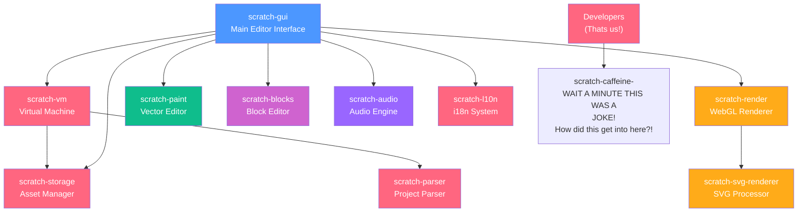
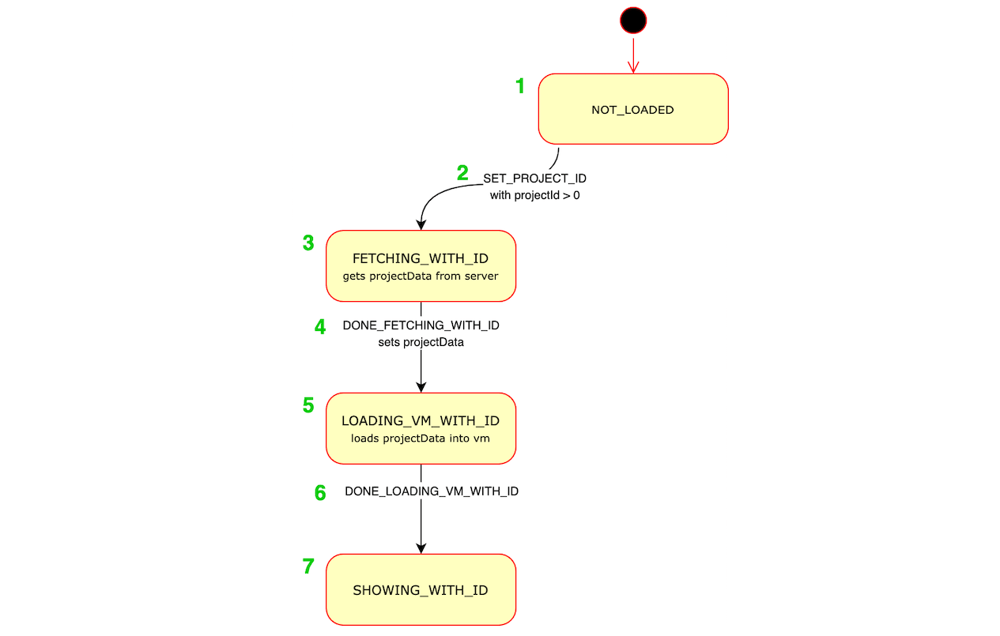

<<<<<<< HEAD
# OmniBlocks - The Ultimate MultiLanguage IDE
# OmniBlocks/scratch-gui


<a href="https://www.star-history.com/#OmniBlocks/scratch-gui&type=date&legend=top-left">
 <picture>
   <source media="(prefers-color-scheme: dark)" srcset="https://api.star-history.com/svg?repos=OmniBlocks/scratch-gui&type=date&theme=dark&legend=top-left" />
   <source media="(prefers-color-scheme: light)" srcset="https://api.star-history.com/svg?repos=OmniBlocks/scratch-gui&type=date&legend=top-left" />
   
 </picture>
</a>

> A fork of the Scratch 3.0 GUI, modified and enhanced for the [TurboWarp](https://turbowarp.org/) compiler and the [OmniBlocks](https://omniblocks.github.io) multi-language IDE.

This repository contains the frontend interface of the Block-Based editor for OmniBlocks and TurboWarp. It builds upon Scratch and TurboWarp's foundation with improvements, addons, themes, and other features for an amazing coding experience.

## Important for Developers!
If you want to fork this repo or contribute with PR's (or modify OmniBlocks as your own), you must follow the following rules from the AGPLv3 license, or you are in violation of it.
* 1. Your fork/mod must be public and open-source.
* 2. Your fork/mod can be paid, but must be licensed under the same AGPLv3 license.

## Try It Out
Try out OmniBlocks: [https://omniblocks.github.io](https://omniblocks.github.io)


### Installation as PWA

1. Open OmniBlocks in Chrome, Edge, or another Chromium-based browser</br>
2. Open the 3 dots menu and hover over "Cast, save, and share." GitHub is used here as an example.</br>
</br>
3. Click "Install" to add OmniBlocks to your desktop</br>
</br>
4. The app will now work offline and can be launched like a native application

https://github.com/user-attachments/assets/986de6a3-47e3-436b-91f5-e169a6a67a4a

We are working on a desktop app for more native access and integration, but this is the best you can get for now, but it is quite great for what it has.

### Enhancements and Improvements
*   **Plenty of Addons:** Dozens of community-built addons for custom blocks, UI tweaks, and new functionality. Many are inherited from TurboWarp and other mods from now, but we will implement some new ones soon.
*   **OmniBlocks IDE:** OmniBlocks plans to be a full-featured IDE extending beyond blocks. There will be editors for text languages like Python and C in the future!
*   **Integrated Tools:** Includes a custom music editor and other quality-of-life improvements. Keep in mind that if you're seeing this, it means the music editor is currently not fully implemented. It works, you can go try it out, but it doesn't fully integrate with OmniBlocks just yet.
*   **Quality of Life**: As said earlier, we add a bunch of subtle, but definitely cool or useful quality-of-life additions, even if they seem niche or workaroundable. Most of these stem from mild annoyances that we ourselves have had, and don't hesitate to report yours too in the issues tab!

### A great feature inherited from TurboWarp: 
*   **High Performance:** This is a fork of TurboWarp, meaning it uses the compiler that TurboWarp uses, making projects run way faster than other projects. This isn't listed as an enhancement/feature since we didn't implement it; the team at TurboWarp did, and we don't claim to have written the TurboWarp compiler that makes OmniBlocks projects run so fast. 

## Vibe Coding
As you can tell by some of the slop in this codebase, I have, for the past month, been experimenting with different AI tools to aid in development of OmniBlocks. I can confirm that it sucks, and I apologize for polluting the codebase with slop. I am in progress of writing about this in an article about my stance on AI that I will show to everyone soon. I will also start to write more code by myself and my fellow human contributors, as it AI is detrimental to my own skills as well.
If you are planning to contribute to OmniBlocks, please don't vibe code large features, or preferably, anything at all. From my experience, AI is best for repetitive, mild tasks, like updating things across files quickly or adding small features, but even these have to go through a review process that takes about 2 days for me. Please don't make PRs with features that are entirely AI-generated, especially if you didn't test the code or review it.

## Quick Start

Want to create your own modification/fork of OmniBlocks, or help contribute to it? Follow the following steps:


### Prerequisites

*   Node.js version Node.js v22 (versions v18 or newer will probably work, but we can’t guarantee it)
*   npm 
*   Git (duhh) 
If you're using a GitHub Codespace, all these things come preinstalled.
**Note about GitHub Codespaces**: to create a GitHub codespace, make sure you are on the repo you want to code in, such as your fork of OmniBlocks. When you are there, click the big green button that says "Code". On the Codespace tab, click the button saying "Create codespace on main". Now, just wait a few minutes, and it will install everything for you. 
<!-- wait like 6 or 7 minutes lol !-->
### Dependencies
Some packages may want some additional things installed, so check the README in each package you want to develop.

OmniBlocks is a very large app that can require multiple gigabytes of disk space and memory to build.
 
Scratch is broken up into a bunch of different packages, each implementing one part of the app. Our dependencies are:

* scratch-gui implements much of the interface (eg. the sprite list), connects everything together, and is where addons live. There are instructions on most of that here :)
* scratch-vm runs projects. It's where the compiler lives, as well as the JavaScript definitions for any blocks. To add a new block, define the block there, and add the gui entry for the block here in scratch-gui.
* scratch-render is what displays things like the stage, sprites, text bubbles, and pen. It also implements blocks like "touching". Note that things that are rendered on top of sprites such as variable monitors are actually part of scratch-gui.
* scratch-svg-renderer helps fix various SVG rendering problems. If you don't know what an SVG is, it is essentially an image with theoretically infinite quality due to using mathematical equations to render instead of pixels.
* scratch-render-fonts contains all the fonts that SVG costumes can use
* scratch-paint is the costume editor. 
* scratch-parser extracts and validates sb2 and sb3 files
* scratch-storage is an abstraction around fetch() used for downloading (and theoretically uploading) files. It is the reason why you can add files to your workspace and they work without being uploaded to any cloud storage.
* scratch-l10n contains translations and localizations. This provides accessibility to people who speak other languages but want to use OmniBlocks.
* scratch-caffeine /j

Here's a diagram to help you understand how these are connected:




### Installation & Running
To actually mod Scratch, you need to build the GUI, as it is the main package that connects everything. Here's how to do it:

1.  **Clone the repository:**
    ```bash
    git clone https://github.com/OmniBlocks/scratch-gui # you can add a .git extension if you want, but it should work fine without it. 
    cd scratch-gui
    ```

2.  **Install dependencies (recommended method):**
    ```bash
    npm ci  # We prefer this as it doesn't modify package-lock.json, which keeps the dependencies the same. 
    ```
    *(If you do decide to use `npm install`, it has to be `npm install --legacy-peer-deps` so it doesn't error)*

3.  **Start the development server:**
    ```bash
    npm start
    ```
    The GUI will open in your browser at `http://localhost:8601`. If you're using GitHub Codespaces, it will be `https://<codespace-name>-<codespace-hash>-8601.app.github.dev/`

4.  **To create a production build:**
    ```bash
    npm run build
    ```
    Output will be in the `build/` directory. You can then use this output with a GitHub Actions workflow or other CI to push to a website or something like that. If you go to our [site build repo,](https://github.com/OmniBlocks/omniblocks.github.io) you can use the `sh` script and `yml` workflow from there 😁


## Development Guide

This section is for developers looking to understand, modify, or contribute to the codebase.

### Data Flow & Structure
<!--- **State Management:** Uses Redux. Reducers are located in `src/reducers/`.
this is already part of the below -->
- **Core GUI Logic:** Located in `src/`.
- **Addons:** Managed in `src/addons/`. If you try hard enough you can make your own by making all the files you need yourself, which is what we do here.
- **Theming:** Theme definitions (Aqua, Blue, etc.) are in `src/lib/themes/accent/<theme>.js`. Global color variables are set in `src/css/colors.css` and overridden in JS as needed.

### Key Workflows
- **Adding a New Addon:** Create a new directory within `src/addons/` with all necessary files and ensure it's imported in the `.js` files located in `src/addons/generated`.
- **Modifying Themes:** Make a new file and title it "<color-name>.js". For example, if you want to make a new yellow theme, you can do "yellow.js". Then look for all the other JS files where the themes are imported, such as scratch-gui/src/lib/themes/index.js.
- **Debugging:** For build issues, inspect the output in the `build/` directory or check the console output from `npm run build`.


### Integration Points
- **Extension Gallery:** `src/lib/libraries/extensions/`
- **Static Assets:**  `static/`.

## Licensing

This project is licensed under multiple agreements due to its forked nature.

- **OmniBlocks Modifications:** Licensed under the **GNU Affero General Public License v3.0**. See the `LICENSE` file or [gnu.org/licenses](https://www.gnu.org/licenses/) for details.

- **Original TurboWarp Code (BSD License):** Copyright (c) TurboWarp contributors. The original license text is retained below as required.

- **Original Scratch Code (BSD License):** Copyright (c) 2016, Massachusetts Institute of Technology. The original license text is retained below as required.

- **Assets:**
  - `src/lib/default-project/dango.svg`: Based on Twemoji, licensed under CC BY 4.0.
  - **OmniBlocks Logo:** Licensed under CC BY-SA 4.0. Incorporates the Python logo (a trademark of the Python Software Foundation) for referential purposes. This project is not affiliated with or endorsed by the Python Software Foundation.
  - **OmniBlocks Mascot "Boxy":** Licensed under CC BY-SA 4.0.
 
While the Logo and Mascot are open source, please do not attempt to impersonate us or try to act on "our behalf" and claim something is endorsed by us when it is not.

<details>
<summary>Original Scratch (BSD) License</summary>

Copyright (c) 2016, Massachusetts Institute of Technology All rights reserved.

Redistribution and use in source and binary forms, with or without modification, are permitted provided that the following conditions are met:

Redistributions of source code must retain the above copyright notice, this list of conditions and the following disclaimer.

Redistributions in binary form must reproduce the above copyright notice, this list of conditions and the following disclaimer in the documentation and/or other materials provided with the distribution.

Neither the name of the copyright holder nor the names of its contributors may be used to endorse or promote products derived from this software without specific prior written permission.

THIS SOFTWARE IS PROVIDED BY THE COPYRIGHT HOLDERS AND CONTRIBUTORS "AS IS" AND ANY EXPRESS OR IMPLIED WARRANTIES, INCLUDING, BUT NOT LIMITED TO, THE IMPLIED WARRANTIES OF MERCHANTABILITY AND FITNESS FOR A PARTICULAR PURPOSE ARE DISCLAIMED. IN NO EVENT SHALL THE COPYRIGHT HOLDER OR CONTRIBUTORS BE LIABLE FOR ANY DIRECT, INDIRECT, INCIDENTAL, SPECIAL, EXEMPLARY, OR CONSEQUENTIAL DAMAGES (INCLUDING, BUT NOT LIMITED TO, PROCUREMENT OF SUBSTITUTE GOODS OR SERVICES; LOSS OF USE, DATA, OR PROFITS; OR BUSINESS INTERRUPTION) HOWEVER CAUSED AND ON ANY THEORY OF LIABILITY, WHETHER IN CONTRACT, STRICT LIABILITY, OR TORT (INCLUDING NEGLIGENCE OR OTHERWISE) ARISING IN ANY WAY OUT OF THE USE OF THIS SOFTWARE, EVEN IF ADVISED OF THE POSSIBILITY OF SUCH DAMAGE.

</details>

Original TurboWarp (GPL-3.0) License: https://github.com/TurboWarp/scratch-gui/blob/develop/LICENSE

## Contributing

Contributions are welcome! We are especially interested in addons, bug fixes, and new features!

1. Fork the project.
2. Create a feature branch (`git checkout -b feature/AmazingFeature`).
3. Code your feature (make sure to follow our super strict style guide below)
4. Commit your changes (`git commit -m 'Add some AmazingFeature'`).
5. Push to the branch (`git push origin feature/AmazingFeature`).
6. Open a Pull Request.
7. Sit and wait as it gets reviewed :)
8. (six seven)


## 📝 The Super Strict Style Guide of Doom 😈
As you may know from the earlier parts of the readme, this is all made in React JS, a modular JavaScript UI framework. We're pretty laid back, so we don't have a super strict style guide or coding conventions, just know the following:

-  Go all out on your code! It doesn't matter if you don't use proper indentation, or other stuff like that, just make sure to add comments explaining it. After all, this is JavaScript, not Python we're talking about, so any valid syntax is valid syntax.
-  Make sure your variables are readable. While everyone loves fun code, please make sure your variables are legible. For example, if you need a variable for a new multi-backpack feature you're planning to add (not quite sure what the feature would do, but it's just an example), we'd prefer "multibackpack" or even "backpackthing" over "qwnpvoitwegjk".
- Absolutely NO profanity. I have seen other repos have profanity in commit messages or comments, and while it is relatable and even hilarious to see how miserably we fail at code sometimes, there is no need to use profanity. Since our project is for All Ages and open source, we assume anyone of all ages will also see the code. Some words, however, are not considered profanity, such as crap or heck. If you snoop in _OUR_ commit messages, we have some pretty hilarious frustrations in there too! Just no bad words.
Other than that, Code On! We don't require much other than these rules. Have fun!


## ❓ Frequently Asked Questions (FAQ)

### General Questions

**Q: What is OmniBlocks?**  
A: OmniBlocks is an enhanced fork of TurboWarp for faster project execution, adds quality-of-life features, and constant updates. We hope to become a full-fledged IDE one day!

**Q: How is OmniBlocks different from TurboWarp?**  
A: While we use TurboWarp's excellent compiler and extra features, OmniBlocks focuses on providing a more advanced, mature IDE. We plan to be able to be used by kids and adults alike, adding new advanced features for already knowledgeable coders, as well as being able to be booted up by children and/or beginners to explore programming. We will also be exploring additional features like alternative language editors (Python/C) in the future.

**Q: Is OmniBlocks free to use?**  
A: Yes! OmniBlocks is open-source and free forever! Unless you count paying your internet provider as an indirect fee ;)

**Q: I hate Ommiblocks**  
A: 67

### Compatibility

**Q: Can I use my Scratch account with OmniBlocks?**  
A: You can't log in with your Scratch Accounts for integration with OmniBlocks, and we don't have any planned features that would use such a thing. Please remember that giving your Scratch password to ANY site, even if it seems good, could be used as bait and take over your Scratch account. If we ever do implement such integration, it will be through secure authentication services, such as ScratchAuth. 
Anyways, you can import/export `.sb3` project files to load a Scratch project into OmniBlocks and code there, and even use the new tools and features to aid development.

**Q: Will projects created in OmniBlocks work in vanilla Scratch?**  
A: Yes! As long as you don't use extensions that add custom blocks not available in vanilla Scratch, your projects will work perfectly. The TurboWarp compiler only affects runtime performance, not project compatibility.

**Q: Can I import my existing Scratch projects?**  
A: Absolutely! Just click "File > Load from your computer" and select your `.sb3` or `.sb2` file. Or even `.sb` if you still use 1.x, ~unc~.

**Q: What about projects with cloud variables? Can I still play online games with OmniBlocks?**
A: Yup! The TurboWarp cloud data server is used to ensure that you can still play your favorite online games in OmniBlocks. Keep in mind that since we don't integrate with Scratch, you can choose any username that exists in Scratch (except for Scratch Team member names), so if you see someone claiming to be a famous Scratcher (e.g., griffpatch), it is most likely not actually that person.

### Features & Development

**Q: What's the status of the music editor feature?**  
A: The music editor is currently in development and not fully integrated. We're working on it, but for now, the traditional sound editor is available. You can go ahead and use it, but if you click out of the tab... well, say goodbye to your music. You can test the raw song editor [here](https://omniblocks.github.io/songeditor.html)

**Q: Can I create my own extensions?**  
A: Yes, but be aware that extension development is complex and requires understanding of Scratch's architecture. Check out the `scratch-vm` repository and our contributing guidelines for more information.

**Q: Can I request new features?**  
A: Yes! Open an issue on our GitHub repository with the "enhancement" label. We love hearing ideas from the community, though we can't guarantee implementation timelines or whether they are going to be added. For example, let's say you want a new feature to be added: the ability to collaborate live with other people. While this is a cool idea in theory, there are many flaws. The smaller problem is that maintaining the servers would cost money, and we want to keep OmniBlocks free. The other bigger problem is that it is simply a huge security risk. Since we want kids to be able to use OmniBlocks, adding such a feature would allow for private communication and other terrible things to happen. We don't want to turn OmniBlocks into a Roblox clone.

### Technical Questions

**Q: What are the system requirements?**  
A: OmniBlocks runs in any modern web browser (Chrome, Firefox, Safari, Edge). Keep in mind that for the best performance and features, Chromium-based browsers are significantly faster, such as Chrome or Edge. For development, you'll need Node.js 18+ and npm. If you don't have access to such tools (for example, if you want to develop on an iPad or tablet), you can start a GitHub Codespace, which is a free browser environment for coding.
For best feature support, install on Microsoft Edge/Chrome as a PWA. As a Firefox user myself, yes, this is painful.

**Q: Can I self-host OmniBlocks?**  
A: Yes! Follow the development setup instructions above, then build the project with `npm run build`. The output in the `build/` directory can be hosted on any static web server.

**Q: The editor is slow/laggy. What can I do?**  
A: Try these steps:
1. Close unnecessary browser tabs
2. Make sure you're using a modern browser
3. Check if your project has very large assets or complex scripts
4. Check for infinite loops in your code or scripts running under custom blocks with "Run without screen refresh" enabled

**Q: I found a bug! Where do I report it?**  
A: Please open an issue on our GitHub repository with:
- A clear description of the bug
- Steps to reproduce it
- Expected vs actual behavior
- Browser and OS information
- Screenshots if applicable, screen video recordings are even better

### Contributions

**Q: I want to contribute! Where do I start?**  
A: Awesome! Read everything above for guidelines. Good starting points are:
- Fixing bugs labeled "good first issue"
- Improving documentation
- Adding tests
- Translating the interface

**Q: Do I need permission to fork OmniBlocks?**  
A: Not at all! That's what's so good about our open source license. You can use our code at the expense of anyone using your code too. Just make sure to follow the license terms and give proper attribution.

**Q: Can we talk to any of the maintainers or just have a chat?**
A: Totally! That's what you do in [the Discussion tab!](https://github.com/orgs/OmniBlocks/discussions) to talk to any of our maintainers.
Q: But aren't you busy?
A: True. I, supervoidcoder, the lead maintainer and creator of OmniBlocks, am very busy as I have to do school and other things too. But I'm not one of those people who is "onLy HeRe foR SeRiOuS sTuFF" or "iM a VeRy ImpOrtanT person With PrioRities, not your FrienD". I genuinely care about anyone that wants to reach out to me.
Most of the maintainers and contributors have our own personal Scratch Account too. Here are some:
- @supervoidcoder: [scratchcode1_2_3](https://scratch.mit.edu/users/scratchcode1_2_3/)
- @8to16: [AmpElectrecuted](https://scratch.mit.edu/users/AmpElectrecuted/) or [8to16](https://scratch.mit.edu/users/8to16/) (banned, unfortunately)
- @Graison-P: [GvYoutube](https://scratch.mit.edu/users/GvYoutube/)
- @NotTheBaton: [TheBaton](https://scratch.mit.edu/users/TheBaton/)

**Q: I tried submitting a pull request for OmniBlocks, but I got tons of lint errors.**
A: Ignore lint. It's only there because it is from upstream, but we don't actually use it. As long as the code itself compiles and runs and is, well, functional, I could literally NOT care LESS if you're indenting with tabs, spaces, or you put 6 or 7 indents instead of 4. Just make sure your code works 😎

## Roadmap

### Current Focus
- [ ] JavaScript Extension
- [ ] Complete music editor integration 

Update: As of 11/12/2025, there is even better integration with the music editor, but it is still largely lacking. The music editor still doesn't have blocks to play your songs with or are stored in the project, but the Iframe is styled way better so it doesn't look like an iframe anymore, and using postmessage, it allows for you to download your songs using the existing export buttons in the song editor, as well as a fullscreen button, so it is far more usable than before where you had to go to omniblocks.github.io/songeditor just for it to be useful (as it's the standalone html instead of the iframe.) We got this working by using a function in the HTML that if detected it was an iframe, it intercepted incoming downloaded files and sent them using postmessage to the mainwindow as payload to be downloaded.


### Short-term Goals (Next 3-6 months)
- [ ] Add monaco react editor

### Long-term Vision
- [ ] Full Python/C++ IDE integration
- [ ] Plugin system for community extensions
- [ ] Advanced debugging tools
- [ ] Specialized Mobile app version
- [ ] Electron App for even deeper integration that PWA's just can't have

### Completed ✅
- [x] Add a bunch of small QoL features


**Still have questions?** Feel free to open an issue here or start a discussion on our GitHub organization!

**Made a mod or a cool project?** We would love to see what people are creating! If you made your own mod of OmniBlocks or made a cool project in it, show it off in [the Discussion tab!](https://github.com/orgs/OmniBlocks/discussions)

<!-- thisi is not a six seeven joke !-->
---

**Note:** This is a fork designed specifically for OmniBlocks. If you want to make your own Scratch or TurboWarp mod, please refer to the [upstream scratch-gui repository](https://github.com/scratchfoundation/scratch-gui) or the [TurboWarp scratch-gui repository](https://github.com/TurboWarp/scratch-gui) instead.

<details><summary>NASA Secret Information</summary>
:egg:
</details>

### Legal

Python is a registered trademark of the Python Software Foundation. Scratch is a registered trademark of the Scratch Foundation. TurboWarp is a community project and is not affiliated with the Scratch Foundation. OmniBlocks and the OmniBlocks team are not affiliated with the Python Software Foundation, the Scratch Foundation, or TurboWarp.
=======
scratch-gui modified for use in [TurboWarp](https://turbowarp.org/)

## Setup

See https://docs.turbowarp.org/development/getting-started to setup the complete TurboWarp environment.

If you just want to play with the GUI then it's the same process as upstream scratch-gui.

## License

TurboWarp's modifications to Scratch are licensed under the GNU General Public License v3.0. See LICENSE or https://www.gnu.org/licenses/ for details.

The following is the original license for scratch-gui, which we are required to retain. This is NOT the license of this project.

```
Copyright (c) 2016, Massachusetts Institute of Technology
All rights reserved.

Redistribution and use in source and binary forms, with or without modification, are permitted provided that the following conditions are met:

1. Redistributions of source code must retain the above copyright notice, this list of conditions and the following disclaimer.

2. Redistributions in binary form must reproduce the above copyright notice, this list of conditions and the following disclaimer in the documentation and/or other materials provided with the distribution.

3. Neither the name of the copyright holder nor the names of its contributors may be used to endorse or promote products derived from this software without specific prior written permission.

THIS SOFTWARE IS PROVIDED BY THE COPYRIGHT HOLDERS AND CONTRIBUTORS "AS IS" AND ANY EXPRESS OR IMPLIED WARRANTIES, INCLUDING, BUT NOT LIMITED TO, THE IMPLIED WARRANTIES OF MERCHANTABILITY AND FITNESS FOR A PARTICULAR PURPOSE ARE DISCLAIMED. IN NO EVENT SHALL THE COPYRIGHT HOLDER OR CONTRIBUTORS BE LIABLE FOR ANY DIRECT, INDIRECT, INCIDENTAL, SPECIAL, EXEMPLARY, OR CONSEQUENTIAL DAMAGES (INCLUDING, BUT NOT LIMITED TO, PROCUREMENT OF SUBSTITUTE GOODS OR SERVICES; LOSS OF USE, DATA, OR PROFITS; OR BUSINESS INTERRUPTION) HOWEVER CAUSED AND ON ANY THEORY OF LIABILITY, WHETHER IN CONTRACT, STRICT LIABILITY, OR TORT (INCLUDING NEGLIGENCE OR OTHERWISE) ARISING IN ANY WAY OUT OF THE USE OF THIS SOFTWARE, EVEN IF ADVISED OF THE POSSIBILITY OF SUCH DAMAGE.
```

src/lib/default-project/dango.svg is based on [Twemoji](https://twemoji.twitter.com/) and is licensed under CC BY 4.0 https://creativecommons.org/licenses/by/4.0/

<!--

# scratch-gui
#### Scratch GUI is a set of React components that comprise the interface for creating and running Scratch 3.0 projects

## Installation
This requires you to have Git and Node.js installed.

In your own node environment/application:
```bash
npm install https://github.com/LLK/scratch-gui.git
```
If you want to edit/play yourself:
```bash
git clone https://github.com/LLK/scratch-gui.git
cd scratch-gui
npm install
```

**You may want to add `--depth=1` to the `git clone` command because there are some [large files in the git repository history](https://github.com/LLK/scratch-gui/issues/5140).**

## Getting started
Running the project requires Node.js to be installed.

## Running
Open a Command Prompt or Terminal in the repository and run:
```bash
npm start
```
Then go to [http://localhost:8601/](http://localhost:8601/) - the playground outputs the default GUI component

## Developing alongside other Scratch repositories

### Getting another repo to point to this code


If you wish to develop `scratch-gui` alongside other scratch repositories that depend on it, you may wish
to have the other repositories use your local `scratch-gui` build instead of fetching the current production
version of the scratch-gui that is found by default using `npm install`.

Here's how to link your local `scratch-gui` code to another project's `node_modules/scratch-gui`.

#### Configuration

1. In your local `scratch-gui` repository's top level:
    1. Make sure you have run `npm install`
    2. Build the `dist` directory by running `BUILD_MODE=dist npm run build`
    3. Establish a link to this repository by running `npm link`

2. From the top level of each repository (such as `scratch-www`) that depends on `scratch-gui`:
    1. Make sure you have run `npm install`
    2. Run `npm link scratch-gui`
    3. Build or run the repository

#### Using `npm run watch`

Instead of `BUILD_MODE=dist npm run build`, you can use `BUILD_MODE=dist npm run watch` instead. This will watch for changes to your `scratch-gui` code, and automatically rebuild when there are changes. Sometimes this has been unreliable; if you are having problems, try going back to `BUILD_MODE=dist npm run build` until you resolve them.

#### Oh no! It didn't work!

If you can't get linking to work right, try:
* Follow the recipe above step by step and don't change the order. It is especially important to run `npm install` _before_ `npm link` as installing after the linking will reset the linking.
* Make sure the repositories are siblings on your machine's file tree, like `.../.../MY_SCRATCH_DEV_DIRECTORY/scratch-gui/` and `.../.../MY_SCRATCH_DEV_DIRECTORY/scratch-www/`.
* Consistent node.js version: If you have multiple Terminal tabs or windows open for the different Scratch repositories, make sure to use the same node version in all of them.
* If nothing else works, unlink the repositories by running `npm unlink` in both, and start over.

## Testing
### Documentation

You may want to review the documentation for [Jest](https://facebook.github.io/jest/docs/en/api.html) and [Enzyme](http://airbnb.io/enzyme/docs/api/) as you write your tests.

See [jest cli docs](https://facebook.github.io/jest/docs/en/cli.html#content) for more options.

### Running tests

*NOTE: If you're a Windows user, please run these scripts in Windows `cmd.exe`  instead of Git Bash/MINGW64.*

Before running any tests, make sure you have run `npm install` from this (scratch-gui) repository's top level.

#### Main testing command

To run linter, unit tests, build, and integration tests, all at once:
```bash
npm test
```

#### Running unit tests

To run unit tests in isolation:
```bash
npm run test:unit
```

To run unit tests in watch mode (watches for code changes and continuously runs tests):
```bash
npm run test:unit -- --watch
```

You can run a single file of integration tests (in this example, the `button` tests):

```bash
$(npm bin)/jest --runInBand test/unit/components/button.test.jsx
```

#### Running integration tests

Integration tests use a headless browser to manipulate the actual HTML and javascript that the repo
produces. You will not see this activity (though you can hear it when sounds are played!).

Note that integration tests require you to first create a build that can be loaded in a browser:

```bash
npm run build
```

Then, you can run all integration tests:

```bash
npm run test:integration
```

Or, you can run a single file of integration tests (in this example, the `backpack` tests):

```bash
$(npm bin)/jest --runInBand test/integration/backpack.test.js
```

If you want to watch the browser as it runs the test, rather than running headless, use:

```bash
USE_HEADLESS=no $(npm bin)/jest --runInBand test/integration/backpack.test.js
```

_Note: If you are seeing failed tests related to `chromedriver` being incompatible with your version of Chrome, you may need to update `chromedriver` with:_

```bash
npm install chromedriver@{version}
```

## Troubleshooting

### Ignoring optional dependencies

When running `npm install`, you can get warnings about optional dependencies:

```
npm WARN optional Skipping failed optional dependency /chokidar/fsevents:
npm WARN notsup Not compatible with your operating system or architecture: fsevents@1.2.7
```

You can suppress them by adding the `no-optional` switch:

```
npm install --no-optional
```

Further reading: [Stack Overflow](https://stackoverflow.com/questions/36725181/not-compatible-with-your-operating-system-or-architecture-fsevents1-0-11)

### Resolving dependencies

When installing for the first time, you can get warnings that need to be resolved:

```
npm WARN eslint-config-scratch@5.0.0 requires a peer of babel-eslint@^8.0.1 but none was installed.
npm WARN eslint-config-scratch@5.0.0 requires a peer of eslint@^4.0 but none was installed.
npm WARN scratch-paint@0.2.0-prerelease.20190318170811 requires a peer of react-intl-redux@^0.7 but none was installed.
npm WARN scratch-paint@0.2.0-prerelease.20190318170811 requires a peer of react-responsive@^4 but none was installed.
```

You can check which versions are available:

```
npm view react-intl-redux@0.* version
```

You will need to install the required version:

```
npm install  --no-optional --save-dev react-intl-redux@^0.7
```

The dependency itself might have more missing dependencies, which will show up like this:

```
user@machine:~/sources/scratch/scratch-gui (491-translatable-library-objects)$ npm install  --no-optional --save-dev react-intl-redux@^0.7
scratch-gui@0.1.0 /media/cuideigin/Linux/sources/scratch/scratch-gui
├── react-intl-redux@0.7.0
└── UNMET PEER DEPENDENCY react-responsive@5.0.0
```

You will need to install those as well:

```
npm install  --no-optional --save-dev react-responsive@^5.0.0
```

Further reading: [Stack Overflow](https://stackoverflow.com/questions/46602286/npm-requires-a-peer-of-but-all-peers-are-in-package-json-and-node-modules)

## Troubleshooting

If you run into npm install errors, try these steps:
1. run `npm cache clean --force`
2. Delete the node_modules directory
3. Delete package-lock.json
4. run `npm install` again

## Publishing to GitHub Pages
You can publish the GUI to github.io so that others on the Internet can view it.
[Read the wiki for a step-by-step guide.](https://github.com/LLK/scratch-gui/wiki/Publishing-to-GitHub-Pages)

## Understanding the project state machine

Since so much code throughout scratch-gui depends on the state of the project, which goes through many different phases of loading, displaying and saving, we created a "finite state machine" to make it clear which state it is in at any moment. This is contained in the file src/reducers/project-state.js .

It can be hard to understand the code in src/reducers/project-state.js . There are several types of data and functions used, which relate to each other:

### Loading states

These include state constant strings like:

* `NOT_LOADED` (the default state),
* `ERROR`,
* `FETCHING_WITH_ID`,
* `LOADING_VM_WITH_ID`,
* `REMIXING`,
* `SHOWING_WITH_ID`,
* `SHOWING_WITHOUT_ID`,
* etc.

### Transitions

These are names for the action which causes a state change. Some examples are:

* `START_FETCHING_NEW`,
* `DONE_FETCHING_WITH_ID`,
* `DONE_LOADING_VM_WITH_ID`,
* `SET_PROJECT_ID`,
* `START_AUTO_UPDATING`,

### How transitions relate to loading states

Like this diagram of the project state machine shows, various transition actions can move us from one loading state to another:


_Note: for clarity, the diagram above excludes states and transitions relating to error handling._

#### Example

Here's an example of how states transition.

Suppose a user clicks on a project, and the page starts to load with URL https://scratch.mit.edu/projects/123456 .

Here's what will happen in the project state machine:



1. When the app first mounts, the project state is `NOT_LOADED`.
2. The `SET_PROJECT_ID` redux action is dispatched (from src/lib/project-fetcher-hoc.jsx), with `projectId` set to `123456`. This transitions the state from `NOT_LOADED` to `FETCHING_WITH_ID`.
3. The `FETCHING_WITH_ID` state. In src/lib/project-fetcher-hoc.jsx, the `projectId` value `123456` is used to request the data for that project from the server.
4. When the server responds with the data, src/lib/project-fetcher-hoc.jsx dispatches the `DONE_FETCHING_WITH_ID` action, with `projectData` set. This transitions the state from `FETCHING_WITH_ID` to `LOADING_VM_WITH_ID`.
5. The `LOADING_VM_WITH_ID` state. In src/lib/vm-manager-hoc.jsx, we load the `projectData` into Scratch's virtual machine ("the vm").
6. When loading is done, src/lib/vm-manager-hoc.jsx dispatches the `DONE_LOADING_VM_WITH_ID` action. This transitions the state from `LOADING_VM_WITH_ID` to `SHOWING_WITH_ID`
7. The `SHOWING_WITH_ID` state. Now the project appears normally and is playable and editable.

## Donate
We provide [Scratch](https://scratch.mit.edu) free of charge, and want to keep it that way! Please consider making a [donation](https://www.scratchfoundation.org/donate) to support our continued engineering, design, community, and resource development efforts. Donations of any size are appreciated. Thank you!
-->
>>>>>>> c455eacd8a66d4b9086f751ca07e203c7ed36571
