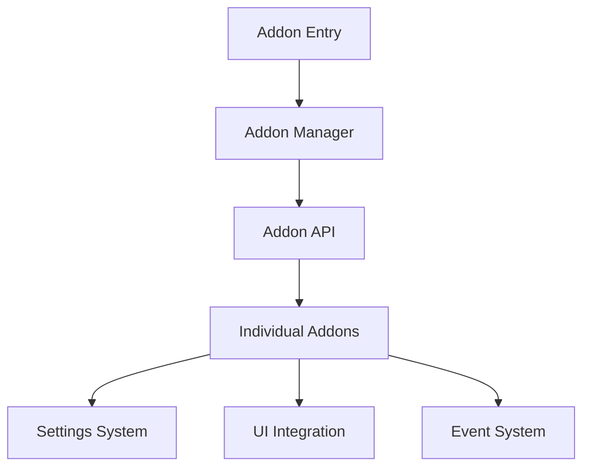
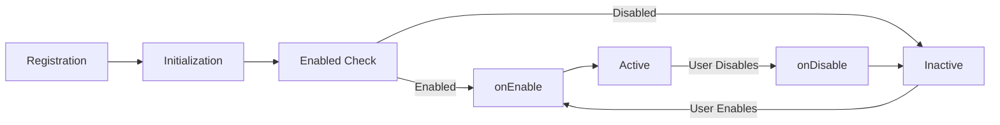

# 🧩 Addons System

Comprehensive guide to OmniBlocks' addon system for extending functionality.

## 🎯 Overview

The addon system allows you to extend OmniBlocks with new features, enhance existing functionality, and customize the user experience without modifying core code.

## 🏗️ Addon Architecture

### System Components



### Directory Structure

```
src/addons/
├── entry.js             # Main entry point
├── addon-api.js         # API definitions
├── addon-manager.js     # Lifecycle management
├── settings/            # Configuration system
│   ├── settings.js      # Settings utilities
│   └── defaults.js      # Default settings
├── libraries/           # Shared libraries
└── [addon-name]/        # Individual addons
    ├── addon.js         # Addon implementation
    ├── settings.js      # Addon-specific settings
    ├── styles.css       # Addon styles
    └── package.json     # Addon metadata
```

## 🚀 Getting Started with Addons

### Enabling Addons

1. **Access Settings**: Click the gear icon → Addons
2. **Browse Addons**: View available addons
3. **Toggle Addons**: Enable/disable with switches
4. **Configure**: Adjust addon-specific settings
5. **Save**: Changes take effect immediately

### Popular Addons

| Addon | Description | Status |
|-------|-------------|--------|
| **Editor Devtools** | Advanced editing features | ✅ Stable |
| **Debugger** | Step-through debugging | ✅ Stable |
| **Custom Themes** | Additional visual themes | ✅ Stable |
| **Block Enhancements** | Extended block functionality | ✅ Stable |
| **Project Analytics** | Performance monitoring | 🟡 Beta |
| **Cloud Integration** | Enhanced cloud features | 🟡 Beta |
| **Hardware Tools** | Device management | 🔴 Experimental |
| **Accessibility** | Enhanced accessibility | ✅ Stable |

## 🛠️ Developing Addons

### Addon Anatomy

```javascript
// src/addons/my-addon/addon.js
const MyAddon = {
    // Addon metadata
    info: {
        id: 'myAddon',
        name: 'My Addon',
        description: 'Description of my addon',
        author: 'Your Name',
        version: '1.0.0',
        tags: ['utility', 'example']
    },
    
    // Addon settings
    settings: {
        enabled: true,
        option1: 'default',
        option2: false
    },
    
    // Lifecycle hooks
    onEnable: function() {
        console.log('Addon enabled');
        // Setup code here
    },
    
    onDisable: function() {
        console.log('Addon disabled');
        // Cleanup code here
    },
    
    // Event handlers
    events: {
        'project.loaded': function(project) {
            console.log('Project loaded:', project);
        }
    },
    
    // UI modifications
    ui: {
        toolbarButtons: [
            {
                id: 'my-button',
                label: 'My Button',
                icon: 'icon.svg',
                onclick: function() {
                    alert('Button clicked!');
                }
            }
        ]
    },
    
    // Block extensions
    blocks: {
        // Block modifications here
    }
};

// Register the addon
addons.register(MyAddon);
```

### Addon Lifecycle



### Creating Your First Addon

1. **Create Directory**: `mkdir src/addons/my-addon`
2. **Add Main File**: Create `addon.js` with basic structure
3. **Add Settings**: Create `settings.js` for configuration
4. **Add Styles**: Create `styles.css` for visual customization
5. **Register Addon**: Add to `src/addons/entry.js`
6. **Test**: Verify addon works in development mode

## 🔌 Addon API Reference

### Core API Functions

```javascript
// Register an addon
addons.register(addonObject);

// Unregister an addon
addons.unregister(addonId);

// Get all registered addons
const allAddons = addons.getAll();

// Get enabled addons
const enabledAddons = addons.getEnabled();

// Check if addon is enabled
const isEnabled = addons.isEnabled('addonId');

// Enable/disable addon
addons.setEnabled('addonId', true);

// Get addon settings
const settings = addons.getSettings('addonId');

// Update addon settings
addons.updateSettings('addonId', { option: 'value' });
```

### Event System

```javascript
// Subscribe to events
addons.on('event.name', callback);

// Unsubscribe from events
addons.off('event.name', callback);

// Emit events
addons.emit('event.name', data);

// Available events
// - 'project.loaded'
// - 'project.saved'
// - 'block.dropped'
// - 'sprite.created'
// - 'addon.enabled'
// - 'addon.disabled'
// - 'settings.changed'
```

### UI Integration

```javascript
// Add toolbar button
addons.ui.addToolbarButton({
    id: 'my-button',
    label: 'My Button',
    icon: 'icon.svg',
    onclick: callback,
    position: 'left' // or 'right'
});

// Remove toolbar button
addons.ui.removeToolbarButton('my-button');

// Add context menu item
addons.ui.addContextMenuItem({
    id: 'my-menu-item',
    label: 'My Menu Item',
    onclick: callback,
    context: 'sprite' // or 'block', 'stage', etc.
});

// Add settings panel
addons.ui.addSettingsPanel({
    id: 'my-settings',
    title: 'My Settings',
    content: ReactComponent,
    icon: 'settings-icon.svg'
});
```

### Block Extensions

```javascript
// Add custom block
addons.blocks.add({
    opcode: 'myBlock',
    blockType: Scratch.BlockType.COMMAND,
    text: 'do something [VALUE]',
    arguments: {
        VALUE: {
            type: Scratch.ArgumentType.STRING,
            defaultValue: 'hello'
        }
    },
    func: function(args) {
        console.log('Block executed:', args.VALUE);
    }
});

// Modify existing block
addons.blocks.modify('motion_movesteps', {
    // Modifications here
});

// Remove block
addons.blocks.remove('blockId');
```

## ⚙️ Addon Settings System

### Settings Structure

```javascript
// Basic settings structure
{
    enabled: true,          // Addon enabled/disabled
    // Addon-specific settings
    featureEnabled: true,
    colorScheme: 'dark',
    autoSave: false,
    notificationLevel: 'info'
}
```

### Settings Management

```javascript
// Define default settings
const defaultSettings = {
    enabled: true,
    option1: 'default',
    option2: false,
    threshold: 50
};

// Load settings
const currentSettings = addons.getSettings('myAddon');

// Update settings
addons.updateSettings('myAddon', {
    option1: 'new-value',
    threshold: 75
});

// Reset to defaults
addons.resetSettings('myAddon');

// Validate settings
function validateSettings(settings) {
    return {
        ...defaultSettings,
        ...settings,
        threshold: Math.max(0, Math.min(100, settings.threshold))
    };
}
```

### Settings UI

```javascript
// Create settings form
const settingsForm = {
    sections: [
        {
            title: 'General Settings',
            fields: [
                {
                    type: 'checkbox',
                    id: 'featureEnabled',
                    label: 'Enable Feature',
                    default: true
                },
                {
                    type: 'select',
                    id: 'colorScheme',
                    label: 'Color Scheme',
                    options: [
                        { value: 'light', label: 'Light' },
                        { value: 'dark', label: 'Dark' }
                    ],
                    default: 'light'
                },
                {
                    type: 'range',
                    id: 'threshold',
                    label: 'Threshold',
                    min: 0,
                    max: 100,
                    step: 5,
                    default: 50
                }
            ]
        }
    ]
};

// Register settings UI
addons.settings.register('myAddon', settingsForm);
```

## 🎨 Addon Styling

### CSS Best Practices

```css
/* Scope styles to addon */
.my-addon-class {
    /* Addon-specific styles */
}

/* Use theme variables */
.my-addon-button {
    background-color: var(--theme-primary);
    color: var(--theme-text);
}

/* Responsive design */
@media (max-width: 768px) {
    .my-addon-panel {
        width: 100%;
    }
}

/* Animation */
@keyframes myAddonAnimation {
    from { opacity: 0; }
    to { opacity: 1; }
}
```

### Dynamic Styling

```javascript
// Add styles dynamically
const styleElement = document.createElement('style');
styleElement.textContent = `
    .my-addon-dynamic {
        color: ${getComputedStyle(document.documentElement)
            .getPropertyValue('--theme-primary')};
    }
`;
document.head.appendChild(styleElement);

// Remove styles when addon disabled
function cleanup() {
    if (styleElement) {
        styleElement.remove();
    }
}
```

## 🔧 Advanced Addon Techniques

### Inter-Addon Communication

```javascript
// Publish event for other addons
addons.emit('myAddon.ready', { version: '1.0.0' });

// Subscribe to other addon events
addons.on('otherAddon.event', data => {
    console.log('Received from other addon:', data);
});

// Check for addon dependencies
function checkDependencies() {
    const requiredAddons = ['dependency1', 'dependency2'];
    const missing = requiredAddons.filter(id => !addons.isEnabled(id));
    
    if (missing.length > 0) {
        console.warn('Missing dependencies:', missing);
        // Disable functionality or show warning
    }
}
```

### Performance Optimization

```javascript
// Debounce expensive operations
function debounce(func, wait) {
    let timeout;
    return function(...args) {
        clearTimeout(timeout);
        timeout = setTimeout(() => func.apply(this, args), wait);
    };
}

// Throttle event handlers
function throttle(func, limit) {
    let lastFunc;
    let lastRan;
    return function(...args) {
        if (!lastRan) {
            func.apply(this, args);
            lastRan = Date.now();
        } else {
            clearTimeout(lastFunc);
            lastFunc = setTimeout(() => {
                if ((Date.now() - lastRan) >= limit) {
                    func.apply(this, args);
                    lastRan = Date.now();
                }
            }, limit - (Date.now() - lastRan));
        }
    };
}

// Memoize expensive computations
function memoize(func) {
    const cache = new Map();
    return function(...args) {
        const key = JSON.stringify(args);
        if (cache.has(key)) {
            return cache.get(key);
        }
        const result = func.apply(this, args);
        cache.set(key, result);
        return result;
    };
}
```

### Error Handling

```javascript
// Graceful error handling
try {
    // Addon code that might fail
    riskyOperation();
} catch (error) {
    console.error('Addon error:', error);
    
    // Notify user
    addons.ui.showNotification({
        type: 'error',
        title: 'Addon Error',
        message: 'An error occurred in My Addon',
        details: error.message
    });
    
    // Disable problematic functionality
    this.disabledFeatures.push('riskyOperation');
}

// Validate inputs
function safeOperation(input) {
    if (!input || typeof input !== 'object') {
        console.warn('Invalid input:', input);
        return defaultValue;
    }
    
    // Safe operation here
}
```

## 🧪 Testing Addons

### Testing Framework

```javascript
// Example addon test
describe('My Addon', () => {
    let addon;
    
    beforeAll(() => {
        // Load and enable addon
        addon = addons.register(myAddon);
        addons.setEnabled('myAddon', true);
    });
    
    afterAll(() => {
        // Cleanup
        addons.setEnabled('myAddon', false);
        addons.unregister('myAddon');
    });
    
    test('should initialize correctly', () => {
        expect(addons.isEnabled('myAddon')).toBe(true);
        expect(addon.info.name).toBe('My Addon');
    });
    
    test('should handle events', () => {
        const mockCallback = jest.fn();
        addons.on('myAddon.event', mockCallback);
        
        addons.emit('myAddon.event', { test: true });
        
        expect(mockCallback).toHaveBeenCalledWith({ test: true });
    });
});
```

### Test Coverage

- **Unit Tests**: Individual addon functions
- **Integration Tests**: Addon interactions with core system
- **UI Tests**: Addon user interface elements
- **Performance Tests**: Impact on application performance
- **Compatibility Tests**: Cross-browser and cross-device testing

## 📦 Packaging and Distribution

### Distribution Formats

1. **Built-in**: Included in OmniBlocks core
2. **User Installable**: Downloadable addon packages
3. **Marketplace**: Centralized addon repository
4. **Custom**: Organization-specific addons

### Addon Package Structure

```
my-addon-package/
├── addon.js             # Addon implementation
├── settings.js          # Configuration
├── styles.css           # Styles
├── assets/              # Additional assets
│   ├── icons/           # Icon files
│   └── images/          # Image assets
├── package.json         # Metadata
├── README.md            # Documentation
└── LICENSE              # License information
```

### Package Metadata

```json
{
    "name": "my-addon",
    "version": "1.0.0",
    "description": "Description of my addon",
    "author": "Your Name <your@email.com>",
    "license": "MIT",
    "omniblocks": {
        "id": "myAddon",
        "category": "utility",
        "compatibility": {
            "minVersion": "1.0.0",
            "maxVersion": "2.0.0"
        },
        "dependencies": ["dependency1", "dependency2"],
        "settings": {
            "schema": "settings-schema.json"
        }
    },
    "keywords": ["addon", "omniblocks", "utility"]
}
```

## 🚧 Troubleshooting Addons

### Common Issues

| Issue | Cause | Solution |
|-------|-------|----------|
| **Addon not appearing** | Registration error | Check `entry.js` registration |
| **Settings not saving** | Invalid settings schema | Validate settings structure |
| **UI conflicts** | CSS specificity issues | Scope styles properly |
| **Performance impact** | Heavy computations | Optimize addon code |
| **Memory leaks** | Uncleaned event listeners | Proper cleanup in `onDisable` |
| **Compatibility issues** | Version mismatch | Check compatibility requirements |

### Debugging Techniques

```javascript
// Debug addon loading
console.log('Addon loading...');

// Check addon state
console.log('Addon enabled:', addons.isEnabled('myAddon'));
console.log('Addon settings:', addons.getSettings('myAddon'));

// Monitor events
addons.on('*', (event, data) => {
    console.log('Event:', event, 'Data:', data);
});

// Profile performance
console.time('addon-operation');
// ... addon code
console.timeEnd('addon-operation');
```

## 📚 Best Practices

### Development Best Practices

1. **Modular Design**: Keep addons focused and independent
2. **Error Handling**: Gracefully handle errors and edge cases
3. **Performance**: Optimize for minimal impact
4. **Documentation**: Provide clear usage instructions
5. **Testing**: Comprehensive test coverage
6. **Versioning**: Follow semantic versioning
7. **Compatibility**: Test across OmniBlocks versions
8. **Security**: Validate all inputs and outputs

### User Experience Best Practices

1. **Intuitive Settings**: Clear and well-organized options
2. **Helpful Error Messages**: Guide users when issues occur
3. **Consistent UI**: Follow OmniBlocks design patterns
4. **Accessibility**: Ensure addon is accessible to all users
5. **Performance Indicators**: Show progress for long operations
6. **Undo Support**: Allow users to revert addon actions
7. **Localization**: Support multiple languages
8. **Documentation**: Provide in-addon help and tutorials

## 🌍 Addon Ecosystem

### Official Addons

- **Maintained by OmniBlocks team**
- **High quality and well-tested**
- **Full documentation and support**
- **Regular updates and security patches**

### Community Addons

- **Created by community members**
- **Varied quality and support levels**
- **Experimental features and innovations**
- **Diverse functionality and use cases**

### Enterprise Addons

- **Organization-specific functionality**
- **Custom branding and integration**
- **Advanced security and compliance**
- **Dedicated support and maintenance**

## 🤝 Contributing Addons

### Submission Process

1. **Develop**: Create your addon
2. **Test**: Verify functionality and compatibility
3. **Document**: Write clear documentation
4. **Package**: Prepare distribution package
5. **Submit**: Open pull request or publish to marketplace
6. **Review**: Address feedback and make improvements
7. **Publish**: Addon becomes available to users

### Contribution Guidelines

- **Code Quality**: Follow OmniBlocks coding standards
- **Documentation**: Provide comprehensive documentation
- **Testing**: Include test cases and scenarios
- **Compatibility**: Support current and recent versions
- **Security**: Follow security best practices
- **Performance**: Optimize for minimal impact
- **Accessibility**: Ensure addon is accessible
- **Localization**: Support internationalization

## 🚀 Future of Addons

### Planned Enhancements

1. **Addon Marketplace**: Centralized discovery and installation
2. **Automatic Updates**: Keep addons up-to-date
3. **Dependency Management**: Handle addon dependencies
4. **Sandboxing**: Improved security and isolation
5. **Performance Monitoring**: Track addon impact
6. **User Ratings**: Community feedback system
7. **Addon Analytics**: Usage statistics (opt-in)
8. **Addon Bundles**: Group related addons

### Community Opportunities

- **New Addon Categories**: Expand functionality areas
- **Addon Templates**: Starter kits for common patterns
- **Addon Documentation**: Improved guides and tutorials
- **Addon Testing**: Enhanced test frameworks
- **Addon Tooling**: Development tools and utilities
- **Addon Examples**: Showcase innovative addons

## 📖 Additional Resources

- **Addon API Reference**: Complete API documentation
- **Addon Examples**: Sample addons and patterns
- **Addon Development Guide**: Step-by-step tutorials
- **Addon Testing Guide**: Testing strategies
- **Addon Security Guide**: Security best practices

For more information about extending OmniBlocks, see our [Extensions Documentation](Extensions.md) and [Development Setup Guide](Development-Setup.md).