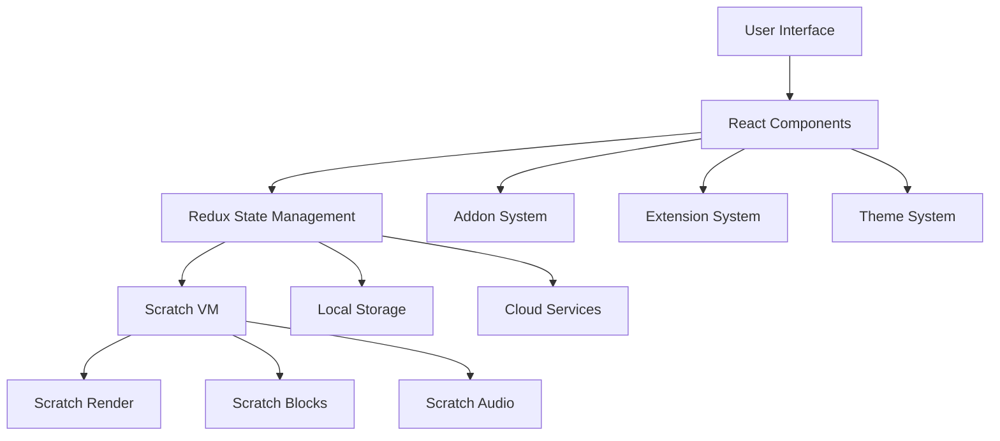
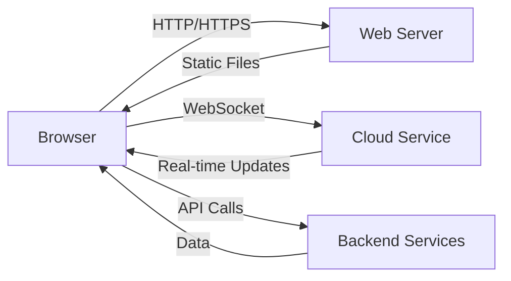
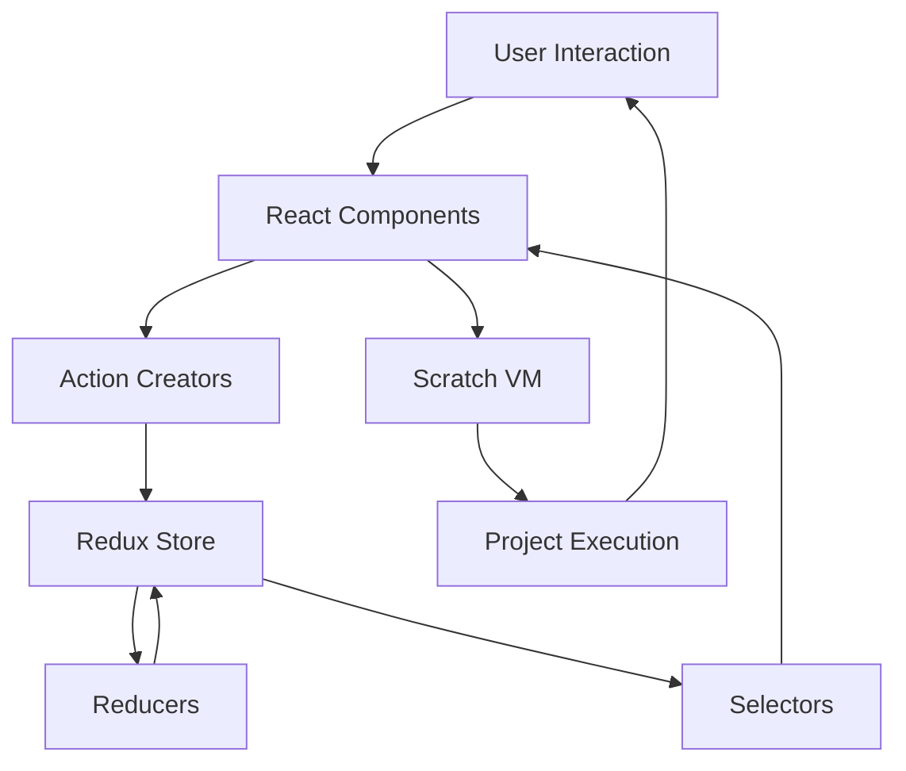
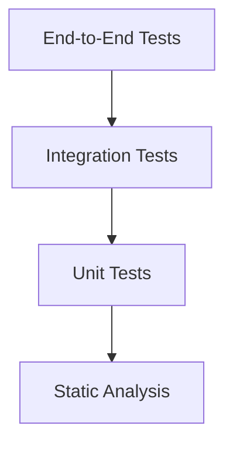
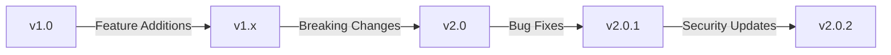
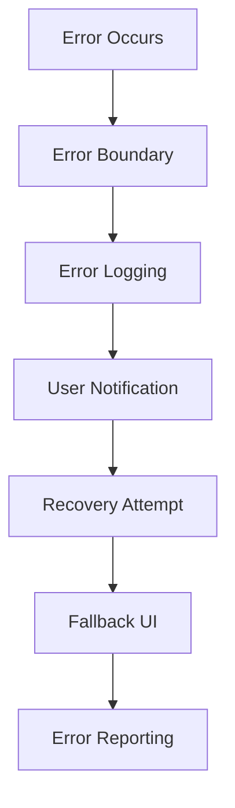
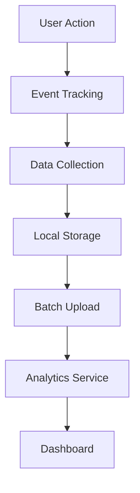

# 🏗️ Architecture Overview

Technical architecture and system design of OmniBlocks.

## 🎯 High-Level Architecture

OmniBlocks follows a modular, component-based architecture built on React and Redux:



## 🧩 Core Components

### 1. Frontend Architecture

#### React Component Hierarchy

```
src/
├── components/       # Presentational components
│   ├── ui/           # UI elements (buttons, inputs)
│   ├── blocks/       # Block-related components
│   ├── sprites/      # Sprite management
│   └── ...
├── containers/       # Redux-connected components
│   ├── Editor.js     # Main editor container
│   ├── Player.js     # Project player
│   └── ...
└── lib/              # Shared functionality
```

#### Key Frontend Technologies

- **React 16**: Component-based UI framework
- **Redux**: State management with middleware
- **React-Redux**: Connect components to Redux store
- **Reselect**: Memoized selectors for performance
- **Immutable.js**: Immutable data structures

### 2. State Management

#### Redux Store Structure

```javascript
{
    // Core state
    editor: { ... },          // Editor UI state
    vm: { ... },              // Virtual machine state
    project: { ... },         // Current project data
    
    // Feature state
    addons: { ... },          // Addon configuration
    extensions: { ... },      // Extension state
    themes: { ... },          // Theme settings
    
    // UI state
    modals: { ... },          // Modal dialogs
    notifications: { ... },   // User notifications
    
    // System state
    preferences: { ... },     // User preferences
    session: { ... }          // Session data
}
```

#### Redux Middleware

- **Thunk**: Async action support
- **Logger**: Development logging
- **Persistence**: Local storage sync
- **Analytics**: Usage tracking (optional)

### 3. Scratch VM Integration

#### VM Architecture

```
src/lib/
├── vm/                  # VM integration layer
│   ├── scratch-vm.js    # Main VM interface
│   ├── extensions.js    # Extension management
│   ├── blocks.js        # Block definitions
│   └── runtime.js       # Runtime environment
```

#### Key VM Components

- **Runtime**: Project execution environment
- **Compiler**: Block-to-JS compilation
- **Thread Manager**: Concurrent script execution
- **Extension Manager**: Custom extension support
- **Asset Manager**: Media resource handling

### 4. Addon System

#### Addon Architecture

```
src/addons/
├── entry.js             # Addon entry point
├── addon-api.js         # Addon API definitions
├── addon-manager.js     # Addon lifecycle management
├── settings/            # Addon configuration
└── [addon-name]/        # Individual addons
    ├── addon.js         # Addon implementation
    ├── settings.js      # Addon settings
    └── styles.css       # Addon styles
```

#### Addon Lifecycle

1. **Registration**: Addon registers with entry.js
2. **Initialization**: Addon sets up hooks and listeners
3. **Activation**: Addon becomes active in UI
4. **Deactivation**: Addon cleans up resources
5. **Unregistration**: Addon removes all traces

### 5. Extension System

#### Extension Architecture

```
src/lib/libraries/extensions/
├── index.js             # Extension registry
├── extension-manager.js # Extension lifecycle
├── [extension-id]/      # Individual extensions
│   ├── extension.js     # Extension implementation
│   ├── blocks.js        # Block definitions
│   └── assets/          # Extension assets
└── custom/              # Custom extensions
```

#### Extension Types

- **Hardware**: Physical device integration
- **Software**: API and service integration
- **Custom**: User-created extensions
- **Experimental**: Cutting-edge features

### 6. Theme System

#### Theme Architecture

```
src/lib/themes/
├── accent/              # Color themes
│   ├── aqua.js          # Default theme
│   ├── blue.js          # Blue theme
│   └── ...
├── theme-utils.js       # Theme utilities
├── theme-context.js     # React context
└── index.js             # Theme registry
```

#### Theme Structure

```javascript
// Example theme definition
export default {
    id: 'aqua',
    name: 'Aqua',
    colors: {
        primary: '#4C97FF',
        secondary: '#0FBD8C',
        background: '#FFFFFF',
        text: '#333333',
        // ... more colors
    },
    styles: {
        // CSS overrides
    }
};
```

## 🔧 Build System

### Webpack Configuration

```javascript
// webpack.config.js
module.exports = [
    // Main editor configuration
    {
        entry: './src/playground/editor.jsx',
        output: {
            path: path.resolve(__dirname, 'build'),
            filename: 'js/editor.[hash].js',
            publicPath: '/'
        },
        module: {
            rules: [
                // Babel loader for JSX/ES6
                { test: /\.jsx?$/, loader: 'babel-loader' },
                // CSS loader with PostCSS
                { test: /\.css$/, use: ['style-loader', 'css-loader', 'postcss-loader'] },
                // Asset loaders
                { test: /\.(png|svg|jpg|gif)$/, loader: 'file-loader' },
                // Font loaders
                { test: /\.(woff|woff2|eot|ttf|otf)$/, loader: 'file-loader' }
            ]
        },
        plugins: [
            new HtmlWebpackPlugin({
                template: 'src/playground/index.ejs',
                filename: 'index.html'
            }),
            new webpack.DefinePlugin({
                'process.env.NODE_ENV': JSON.stringify(process.env.NODE_ENV)
            })
        ]
    },
    // Additional configurations for player, embed, etc.
];
```

### Build Modes

| Mode | Purpose | Output | Features |
|------|---------|--------|----------|
| **Development** | Local development | `build/` | Hot reloading, source maps |
| **Production** | Deployment ready | `build/` | Minified, optimized |
| **Standalone** | Self-contained | `standalone/` | Inlined assets, single files |
| **Library** | Integration | `dist/` | UMD module format |

## 🌐 Network Architecture

### Client-Server Communication



### Service Worker Architecture

- **Asset Caching**: Cache static resources for offline use
- **Project Caching**: Store projects locally
- **Update Management**: Handle app updates gracefully
- **Background Sync**: Sync data when connection restored

## 📦 Dependency Management

### Core Dependencies

| Category | Key Packages |
|----------|--------------|
| **React Ecosystem** | react, react-dom, react-redux, redux |
| **Build Tools** | webpack, babel, postcss, eslint |
| **Scratch Core** | scratch-vm, scratch-render, scratch-blocks |
| **Testing** | jest, enzyme, playwright |
| **Utilities** | lodash, immutable, classnames |

### Dependency Tree

```
scratch-gui
├── react (16.14.0)
├── redux (4.2.1)
├── scratch-vm (0.2.0-prerelease.20230605153902)
│   ├── scratch-render
│   ├── scratch-audio
│   └── ...
├── scratch-blocks (3.17.0)
├── scratch-paint
└── ...
```

## 🔄 Data Flow

### Unidirectional Data Flow



### Key Data Flow Patterns

1. **User Interaction → Action → Reducer → Store → Component Update**
2. **Component Mount → Data Fetch → Store Update → Component Render**
3. **VM Event → Store Update → Component Reaction → User Feedback**

## 🧪 Testing Architecture

### Test Pyramid



### Test Categories

| Type | Framework | Location | Purpose |
|------|-----------|----------|---------|
| **Unit** | Jest | `test/unit/` | Individual component testing |
| **Integration** | Jest/Enzyme | `test/integration/` | Component interaction testing |
| **E2E** | Playwright | `test/smoke/` | Full application testing |
| **Snapshot** | Jest | `test/snapshots/` | Visual regression testing |

## 📁 File Structure Best Practices

### Recommended Structure

```
src/
├── components/           # Reusable UI components
│   ├── Button/           # Component directory
│   │   ├── Button.jsx    # Component implementation
│   │   ├── Button.css    # Component styles
│   │   ├── Button.test.js # Component tests
│   │   └── index.js      # Component export
│   └── ...
├── containers/           # Redux-connected components
├── lib/                  # Shared libraries
│   ├── utils/            # Utility functions
│   ├── hooks/            # Custom React hooks
│   ├── context/          # React contexts
│   └── ...
├── redux/                # Redux-specific code
│   ├── actions/          # Action creators
│   ├── reducers/         # Reducers
│   ├── selectors/        # Memoized selectors
│   └── store.js          # Store configuration
└── ...
```

### Naming Conventions

- **Components**: PascalCase (`MyComponent.jsx`)
- **Utilities**: camelCase (`stringUtils.js`)
- **Constants**: UPPER_CASE (`CONFIG.js`)
- **Tests**: `Component.test.js`
- **Styles**: `Component.css` or `Component.module.css`

## 🎨 Styling Architecture

### CSS Strategy

- **CSS Modules**: Scoped component styles
- **PostCSS**: CSS processing and optimization
- **Sass**: Advanced styling features (limited use)
- **Inline Styles**: Dynamic styling needs
- **Theme Variables**: CSS custom properties for theming

### Responsive Design

- **Mobile-First**: Base styles for mobile, media queries for larger screens
- **Breakpoints**: Standardized breakpoints for consistency
- **Flexible Units**: Use rem, em, and % for scalable layouts
- **Touch Targets**: Minimum 48×48px for touch interfaces

## 🚀 Performance Architecture

### Performance Optimization Strategies

1. **Code Splitting**: Dynamic imports for lazy loading
2. **Memoization**: `React.memo()` and `useMemo()`
3. **Virtualization**: Virtual lists for large datasets
4. **Debouncing**: Optimize event handlers
5. **Web Workers**: Offload heavy computations
6. **Service Workers**: Enable offline functionality

### Performance Monitoring

- **React Profiler**: Component rendering analysis
- **Web Vitals**: Core web metrics tracking
- **Custom Metrics**: Application-specific performance tracking
- **Error Tracking**: Sentry integration for error monitoring

## 🔧 Configuration Management

### Environment Variables

```javascript
// .env file
NODE_ENV=development
PUBLIC_URL=/
REACT_APP_VERSION=1.0.0
REACT_APP_API_URL=https://api.omniblocks.org
REACT_APP_DEBUG=true
```

### Configuration Files

- **webpack.config.js**: Build configuration
- **babel.config.js**: JavaScript compilation
- **postcss.config.js**: CSS processing
- **jest.config.js**: Testing configuration
- **eslint.config.js**: Code quality rules

## 🌍 Internationalization Architecture

### i18n System

```
src/lib/tw-translations/
├── en.json               # English translations
├── es.json               # Spanish translations
├── fr.json               # French translations
├── ...
├── translation-utils.js  # Translation utilities
└── index.js              # Translation registry
```

### Translation Workflow

1. **Extract Strings**: Identify translatable text
2. **Create Keys**: Generate translation keys
3. **Add Translations**: Populate translation files
4. **Fallback Chain**: en → user language → default
5. **Dynamic Loading**: Load translations on demand

## 🔄 Update and Migration Strategy

### Versioning

- **Semantic Versioning**: MAJOR.MINOR.PATCH
- **Pre-releases**: alpha, beta, rc tags
- **Build Metadata**: Commit hash and timestamp

### Migration Path



### Backward Compatibility

- **Project Files**: Maintain SB3 compatibility
- **APIs**: Deprecation warnings before removal
- **Extensions**: Versioned extension support
- **Addons**: Addon compatibility layers

## 📚 Documentation Architecture

### Documentation Structure

```
docs/
├── Home.md                  # Main landing page
├── Architecture.md          # This file
├── Development-Setup.md     # Setup guide
├── Addons-System.md         # Addon documentation
├── Extensions.md            # Extension development
├── Theming.md               # Theme system
├── API-Reference.md         # API documentation
├── Components.md            # Component reference
├── Troubleshooting.md       # Common issues
└── FAQ.md                   # Frequently asked questions
```

### Documentation Generation

- **Markdown**: GitHub Flavored Markdown
- **Code Examples**: Syntax-highlighted snippets
- **Diagrams**: Mermaid.js for architecture diagrams
- **Screenshots**: Visual aids and examples
- **Cross-references**: Internal linking between pages

## 🤝 Integration Points

### External System Integration

1. **Scratch VM**: Core project execution
2. **Scratch Render**: Visual rendering engine
3. **Scratch Blocks**: Block editing interface
4. **Scratch Audio**: Audio processing
5. **Scratch Paint**: Vector editor
6. **Cloud Services**: Project storage and sharing
7. **Hardware APIs**: Device integration
8. **Analytics**: Usage tracking (optional)

### Extension Points

- **Block Definitions**: Add new blocks
- **VM Extensions**: Extend runtime capabilities
- **UI Components**: Add custom interface elements
- **Event Hooks**: Intercept and modify behavior
- **Data Transformers**: Modify project data

## 🚧 Error Handling Architecture

### Error Handling Strategy



### Error Categories

- **User Errors**: Invalid input, misuse
- **Network Errors**: API failures, timeouts
- **Render Errors**: Visual rendering issues
- **Runtime Errors**: Project execution failures
- **System Errors**: Critical application failures

## 📈 Analytics Architecture

### Analytics System (Optional)



### Privacy Considerations

- **Opt-in**: Analytics disabled by default
- **Anonymization**: No personally identifiable information
- **Data Minimization**: Collect only essential data
- **Transparency**: Clear privacy policy and controls

## 🔮 Future Architecture Directions

### Planned Improvements

1. **Monorepo Migration**: Consolidate related repositories
2. **TypeScript Adoption**: Gradual migration to TypeScript
3. **WebAssembly**: Performance-critical components
4. **Micro-frontends**: Modular architecture
5. **Enhanced Offline**: Better offline capabilities
6. **Desktop Integration**: Electron-based desktop app

### Technical Debt Areas

- **Legacy Code**: Gradual modernization
- **Dependency Updates**: Regular dependency maintenance
- **Build Optimization**: Faster build times
- **Test Coverage**: Improved test coverage
- **Documentation**: Comprehensive API documentation

## 📖 Additional Resources

- **React Architecture**: [https://reactjs.org/docs/faq-architecture.html](https://reactjs.org/docs/faq-architecture.html)
- **Redux Best Practices**: [https://redux.js.org/style-guide](https://redux.js.org/style-guide)
- **Webpack Optimization**: [https://webpack.js.org/guides/code-splitting](https://webpack.js.org/guides/code-splitting)
- **Scratch VM Architecture**: [https://github.com/LLK/scratch-vm/blob/develop/docs/architecture.md](https://github.com/LLK/scratch-vm/blob/develop/docs/architecture.md)
- **TurboWarp Architecture**: [https://docs.turbowarp.org/architecture](https://docs.turbowarp.org/architecture)

For implementation details, see our [Development Setup Guide](Development-Setup.md) and [Component Documentation](Components.md).