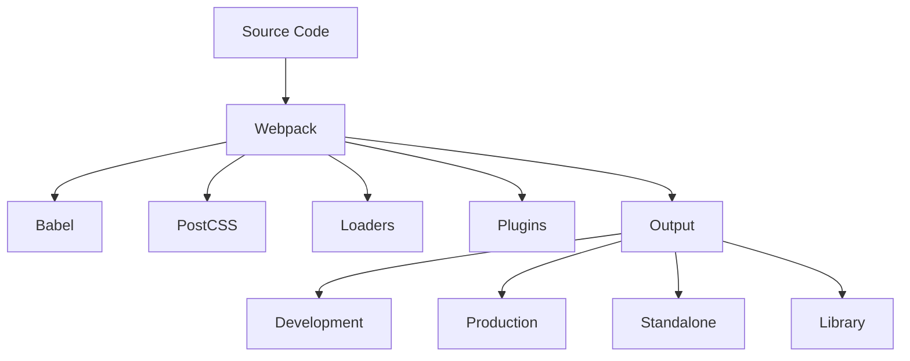
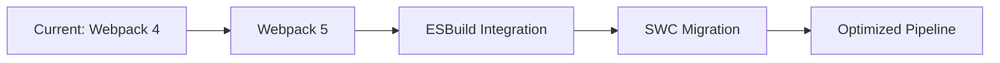

# 🏗️ Build System Guide

Comprehensive guide to OmniBlocks' build system and configuration.

## 🎯 Overview

OmniBlocks uses a sophisticated build system based on Webpack 4, Babel 7, and PostCSS to compile the React-based application into optimized production-ready code.

## 🏗️ Build System Architecture

### Core Components



### Build Process Flow

```
src/ (Source)
  → Webpack Entry Points
  → Babel Transpilation (ES6+ → ES5)
  → PostCSS Processing (CSS)
  → Asset Optimization (Images, Fonts)
  → Code Splitting (Production)
  → Minification (Production)
  → Output to build/standalone/dist/
```

## 📁 Build Configuration

### Webpack Configuration Structure

```javascript
// webpack.config.js
const path = require('path');
const webpack = require('webpack');
const HtmlWebpackPlugin = require('html-webpack-plugin');

module.exports = [
    // Main editor configuration
    {
        name: 'editor',
        entry: './src/playground/editor.jsx',
        output: {
            path: path.resolve(__dirname, 'build'),
            filename: 'js/[name].[hash].js',
            chunkFilename: 'js/[name].[chunkhash].js',
            publicPath: '/'
        },
        module: {
            rules: [
                // JavaScript/JSX
                { test: /\.jsx?$/, loader: 'babel-loader' },
                // CSS
                { test: /\.css$/, use: ['style-loader', 'css-loader', 'postcss-loader'] },
                // Assets
                { test: /\.(png|svg|jpg|gif)$/, loader: 'file-loader' },
                { test: /\.(woff|woff2|eot|ttf|otf)$/, loader: 'file-loader' }
            ]
        },
        plugins: [
            new HtmlWebpackPlugin({
                template: 'src/playground/index.ejs',
                filename: 'index.html',
                chunks: ['editor']
            }),
            new webpack.DefinePlugin({
                'process.env.NODE_ENV': JSON.stringify(process.env.NODE_ENV)
            })
        ],
        optimization: {
            splitChunks: { chunks: 'all' },
            runtimeChunk: true
        }
    },
    
    // Additional configurations for player, embed, etc.
];
```

### Environment Variables

```bash
# Development
NODE_ENV=development

# Production
NODE_ENV=production

# Standalone build
BUILD_MODE=standalone

# Library build
BUILD_MODE=dist
```

## 🚀 Build Commands

### Basic Commands

```bash
# Start development server
npm start

# Create production build
npm run build

# Create standalone build
npm run build:standalone

# Create library build
npm run build:dist

# Clean build artifacts
npm run clean

# Run tests
npm test

# Check linting
npm run lint

# Format code
npm run format
```

### Advanced Commands

```bash
# Build with specific environment
NODE_ENV=production npm run build

# Build with custom port
PORT=8602 npm start

# Build with verbose output
npm run build -- --verbose

# Build specific entry
npm run build -- --env.entry=editor

# Analyze bundle size
npm run build -- --env.analyze
```

## 📦 Build Modes

### Development Mode

**Purpose:** Local development with hot reloading

**Features:**
- Hot module replacement
- Source maps for debugging
- No minification
- Development optimizations
- Fast rebuilds

**Command:**
```bash
npm start
```

**Output:** `build/` directory

### Production Mode

**Purpose:** Optimized build for deployment

**Features:**
- Code minification
- Tree shaking
- Asset optimization
- Code splitting
- Production optimizations

**Command:**
```bash
npm run build
```

**Output:** `build/` directory

### Standalone Mode

**Purpose:** Self-contained HTML files

**Features:**
- All assets inlined
- Single file output
- No external dependencies
- Offline ready

**Command:**
```bash
npm run build:standalone
```

**Output:** `standalone/` directory

### Library Mode

**Purpose:** Build as reusable library

**Features:**
- UMD module format
- External dependencies
- Library optimizations
- Integration ready

**Command:**
```bash
npm run build:dist
```

**Output:** `dist/` directory

## 🔧 Webpack Configuration

### Entry Points

```javascript
// Multiple entry points
entry: {
    editor: './src/playground/editor.jsx',
    player: './src/playground/player.jsx',
    embed: './src/playground/embed.jsx',
    fullscreen: './src/playground/fullscreen.jsx'
}
```

### Output Configuration

```javascript
output: {
    path: path.resolve(__dirname, 'build'),
    filename: 'js/[name].[hash].js',      // Entry chunks
    chunkFilename: 'js/[name].[chunkhash].js', // Async chunks
    publicPath: '/'                        // Base path for assets
}
```

### Module Rules

```javascript
module: {
    rules: [
        // JavaScript/JSX
        {
            test: /\.jsx?$/,
            loader: 'babel-loader',
            exclude: /node_modules/,
            options: {
                presets: ['@babel/preset-env', '@babel/preset-react'],
                plugins: ['@babel/plugin-proposal-class-properties']
            }
        },
        
        // CSS
        {
            test: /\.css$/,
            use: [
                'style-loader',           // Injects CSS into DOM
                'css-loader',             // Resolves @import and url()
                'postcss-loader'          // Processes CSS
            ]
        },
        
        // Images
        {
            test: /\.(png|svg|jpg|gif)$/,
            loader: 'file-loader',
            options: {
                name: 'static/media/[name].[hash:8].[ext]',
                esModule: false
            }
        },
        
        // Fonts
        {
            test: /\.(woff|woff2|eot|ttf|otf)$/,
            loader: 'file-loader',
            options: {
                name: 'static/fonts/[name].[hash:8].[ext]',
                esModule: false
            }
        }
    ]
}
```

### Plugins

```javascript
plugins: [
    // HTML generation
    new HtmlWebpackPlugin({
        template: 'src/playground/index.ejs',
        filename: 'index.html',
        chunks: ['editor'],
        minify: process.env.NODE_ENV === 'production' ? {
            collapseWhitespace: true,
            removeComments: true,
            removeRedundantAttributes: true,
            removeScriptTypeAttributes: true,
            removeStyleLinkTypeAttributes: true,
            useShortDoctype: true
        } : false
    }),
    
    // Environment variables
    new webpack.DefinePlugin({
        'process.env.NODE_ENV': JSON.stringify(process.env.NODE_ENV),
        'process.env.PUBLIC_URL': JSON.stringify(process.env.PUBLIC_URL || '/')
    }),
    
    // Progress reporting
    new webpack.ProgressPlugin(),
    
    // Manifest generation
    new WebpackManifestPlugin({
        fileName: 'asset-manifest.json'
    })
]
```

### Optimization

```javascript
optimization: {
    // Code splitting
    splitChunks: {
        chunks: 'all',
        name: false,
        cacheGroups: {
            vendors: {
                test: /[\/]node_modules[\/]/,
                priority: -10
            },
            default: {
                minChunks: 2,
                priority: -20,
                reuseExistingChunk: true
            }
        }
    },
    
    // Runtime chunk
    runtimeChunk: {
        name: 'runtime'
    },
    
    // Minification
    minimizer: [
        new TerserPlugin({
            terserOptions: {
                parse: { ecma: 8 },
                compress: {
                    ecma: 5,
                    warnings: false,
                    comparisons: false,
                    inline: 2
                },
                mangle: { safari10: true },
                output: {
                    ecma: 5,
                    comments: false,
                    ascii_only: true
                }
            },
            sourceMap: false
        }),
        new OptimizeCSSAssetsPlugin({})
    ]
}
```

## 🛠️ Babel Configuration

### .babelrc

```json
{
    "presets": [
        "@babel/preset-env",
        "@babel/preset-react"
    ],
    "plugins": [
        "@babel/plugin-proposal-class-properties",
        "@babel/plugin-proposal-object-rest-spread",
        "@babel/plugin-transform-runtime",
        ["@babel/plugin-proposal-decorators", { "legacy": true }],
        ["@babel/plugin-proposal-private-methods", { "loose": true }]
    ],
    "env": {
        "development": {
            "plugins": [
                "react-hot-loader/babel"
            ]
        },
        "test": {
            "plugins": [
                "dynamic-import-node"
            ]
        }
    }
}
```

### Babel Presets

| Preset | Purpose |
|--------|---------|
| `@babel/preset-env` | Compile ES6+ to ES5 |
| `@babel/preset-react` | Compile JSX to JavaScript |
| `@babel/preset-flow` | Flow type annotations |
| `@babel/preset-typescript` | TypeScript support |

### Babel Plugins

| Plugin | Purpose |
|--------|---------|
| `proposal-class-properties` | Class properties |
| `proposal-object-rest-spread` | Object rest/spread |
| `transform-runtime` | Runtime transformations |
| `proposal-decorators` | Decorator support |
| `proposal-private-methods` | Private methods |

## 🎨 PostCSS Configuration

### postcss.config.js

```javascript
module.exports = {
    plugins: [
        require('postcss-import'),
        require('postcss-mixins'),
        require('postcss-nested'),
        require('postcss-simple-vars'),
        require('postcss-color-function'),
        require('autoprefixer')({
            overrideBrowserslist: [
                '>1%',
                'last 4 versions',
                'Firefox ESR',
                'not ie < 9'
            ],
            flexbox: 'no-2009'
        }),
        require('postcss-reporter')
    ]
};
```

### PostCSS Plugins

| Plugin | Purpose |
|--------|---------|
| `postcss-import` | Import CSS files |
| `postcss-mixins` | CSS mixins |
| `postcss-nested` | Nested CSS rules |
| `postcss-simple-vars` | CSS variables |
| `postcss-color-function` | Color functions |
| `autoprefixer` | Vendor prefixes |
| `postcss-reporter` | Error reporting |

## 📦 Asset Management

### Asset Types

| Type | Loader | Output |
|------|--------|--------|
| JavaScript | babel-loader | js/[name].[hash].js |
| CSS | style-loader, css-loader, postcss-loader | Inlined or separate CSS |
| Images | file-loader | static/media/[name].[hash].[ext] |
| Fonts | file-loader | static/fonts/[name].[hash].[ext] |
| SVG | file-loader | static/media/[name].[hash].svg |
| Audio | file-loader | static/media/[name].[hash].[ext] |

### Asset Optimization

```javascript
// Image optimization
{
    test: /\.(png|jpg|gif)$/,
    use: [
        {
            loader: 'file-loader',
            options: {
                name: 'static/media/[name].[hash:8].[ext]'
            }
        },
        {
            loader: 'image-webpack-loader',
            options: {
                mozjpeg: {
                    progressive: true,
                    quality: 65
                },
                optipng: {
                    enabled: false
                },
                pngquant: {
                    quality: [0.65, 0.90],
                    speed: 4
                },
                gifsicle: {
                    interlaced: false
                },
                webp: {
                    quality: 75
                }
            }
        }
    ]
}
```

## 🔄 Build Process Customization

### Adding New Entry Points

1. **Create entry file**: `src/playground/new-entry.jsx`
2. **Add to webpack config**: New entry in `entry` object
3. **Create template**: EJS template if needed
4. **Update HTML plugin**: Add new HtmlWebpackPlugin instance
5. **Test**: Verify new entry works

### Modifying Loaders

1. **Identify loader**: Find relevant loader in config
2. **Update options**: Modify loader options
3. **Add new loaders**: For additional file types
4. **Test changes**: Verify loader works correctly
5. **Document**: Update documentation

### Adding Plugins

1. **Install plugin**: `npm install --save-dev plugin-name`
2. **Add to config**: Import and add to plugins array
3. **Configure**: Set plugin options
4. **Test**: Verify plugin works
5. **Document**: Explain plugin purpose

## 🧪 Build Testing

### Testing Build Output

```bash
# Build for testing
npm run build

# Serve build locally
npx serve -s build

# Test in different browsers
# Chrome, Firefox, Safari, Edge

# Test performance
lighthouse http://localhost:5000
```

### Build Validation

```javascript
// Validate build output
const fs = require('fs');
const path = require('path');

function validateBuild() {
    const buildPath = path.resolve(__dirname, 'build');
    
    // Check required files
    const requiredFiles = [
        'index.html',
        'static/js/main.js',
        'static/css/main.css'
    ];
    
    requiredFiles.forEach(file => {
        const filePath = path.join(buildPath, file);
        if (!fs.existsSync(filePath)) {
            console.error(`Missing file: ${file}`);
        }
    });
    
    // Check file sizes
    const mainJs = fs.statSync(path.join(buildPath, 'static/js/main.js'));
    console.log(`Main JS size: ${mainJs.size / 1024} KB`);
    
    // Check HTML structure
    const html = fs.readFileSync(path.join(buildPath, 'index.html'), 'utf8');
    if (!html.includes('<div id="app"></div>')) {
        console.error('Missing app container');
    }
}

validateBuild();
```

## ⚡ Performance Optimization

### Bundle Analysis

```bash
# Analyze bundle size
npm run build -- --env.analyze

# Or use webpack-bundle-analyzer
npx webpack-bundle-analyzer build/stats.json
```

### Optimization Techniques

1. **Code Splitting**: Split code into chunks
2. **Tree Shaking**: Remove unused code
3. **Minification**: Reduce file sizes
4. **Compression**: Enable gzip/brotli
5. **Caching**: Configure proper cache headers
6. **Lazy Loading**: Load code on demand
7. **Preloading**: Prioritize critical resources

### Code Splitting Example

```javascript
// Dynamic import for lazy loading
const MyComponent = React.lazy(() => import('./MyComponent'));

// Usage with Suspense
function App() {
    return (
        <React.Suspense fallback={<div>Loading...</div>}>
            <MyComponent />
        </React.Suspense>
    );
}
```

## 📦 Deployment Strategies

### GitHub Pages

```bash
# Build for GitHub Pages
npm run build

# Deploy to GitHub Pages
npm run deploy
```

### Static Hosting

```bash
# Build for static hosting
npm run build

# Copy to hosting directory
cp -r build/* /var/www/html/
```

### Docker Deployment

```dockerfile
FROM node:22 as builder
WORKDIR /app
COPY . .
RUN npm ci
RUN npm run build

FROM nginx:alpine
COPY --from=builder /app/build /usr/share/nginx/html
COPY nginx.conf /etc/nginx/conf.d/default.conf
EXPOSE 80
CMD ["nginx", "-g", "daemon off;"]
```

### Cloud Deployment

```bash
# Build for cloud
npm run build

# Deploy to Vercel
vercel

# Deploy to Netlify
netlify deploy

# Deploy to AWS
aws s3 sync build/ s3://your-bucket-name
```

## 🔧 Troubleshooting Build Issues

### Common Build Problems

| Issue | Cause | Solution |
|-------|-------|----------|
| **Build fails** | Missing dependencies | `npm ci` |
| **Slow builds** | Too many dependencies | Optimize webpack config |
| **Large bundles** | Unused code | Enable tree shaking |
| **Asset issues** | Incorrect loaders | Fix file loader config |
| **CSS problems** | PostCSS errors | Check PostCSS config |
| **JS errors** | Babel issues | Verify Babel config |

### Debugging Build Issues

```bash
# Build with verbose output
npm run build -- --verbose

# Check specific errors
npm run build 2> build-error.log

# Build with stats
npm run build -- --profile --json > stats.json

# Analyze stats
npx webpack-bundle-analyzer stats.json
```

### Build Error Examples

**Module Not Found:**
```
ERROR in ./src/components/MyComponent.jsx
Module not found: Error: Can't resolve './MyOtherComponent' in '/src/components'
```
**Solution:** Check import paths and file existence

**Syntax Error:**
```
ERROR in ./src/components/MyComponent.jsx
Module build failed: SyntaxError: Unexpected token (10:25)
```
**Solution:** Fix JavaScript syntax error

**Loader Error:**
```
ERROR in ./src/styles/main.css
Module build failed: Error: PostCSS plugin postcss-import requires postcss@^8.0.0
```
**Solution:** Update PostCSS plugins or configuration

## 📚 Best Practices

### Build Configuration Best Practices

1. **Keep it simple**: Avoid unnecessary complexity
2. **Document changes**: Explain configuration modifications
3. **Test thoroughly**: Verify build output works
4. **Optimize carefully**: Balance performance and maintainability
5. **Update regularly**: Keep dependencies current
6. **Monitor size**: Track bundle size growth
7. **Use caching**: Improve build performance

### Performance Best Practices

1. **Code splitting**: Split large bundles
2. **Tree shaking**: Remove unused code
3. **Minification**: Reduce file sizes
4. **Compression**: Enable gzip/brotli
5. **Caching**: Configure proper headers
6. **Lazy loading**: Load on demand
7. **Preloading**: Prioritize critical resources

### Maintenance Best Practices

1. **Regular updates**: Keep dependencies current
2. **Monitor issues**: Track build-related problems
3. **Document changes**: Explain modifications
4. **Test updates**: Verify dependency updates
5. **Backup configs**: Keep copies of working configs
6. **Monitor performance**: Track build times
7. **Clean regularly**: Remove unused dependencies

## 🚀 Advanced Build Techniques

### Custom Loaders

```javascript
// Custom loader example
module.exports = function(source) {
    // Process source code
    const processed = processSource(source);
    
    // Return processed code
    return processed;
};
```

### Custom Plugins

```javascript
// Custom plugin example
class MyPlugin {
    apply(compiler) {
        compiler.hooks.emit.tap('MyPlugin', (compilation) => {
            // Modify compilation
            compilation.assets['custom.txt'] = {
                source: () => 'Custom content',
                size: () => 13
            };
        });
    }
}

module.exports = MyPlugin;
```

### Multi-Configuration Builds

```javascript
// Multiple configurations
module.exports = [
    // Development config
    { name: 'dev', mode: 'development', /* ... */ },
    
    // Production config
    { name: 'prod', mode: 'production', /* ... */ },
    
    // Standalone config
    { name: 'standalone', /* ... */ }
];
```

## 📈 Build System Evolution

### Future Improvements

1. **Webpack 5**: Upgrade to latest Webpack
2. **ESBuild**: Faster builds with ESBuild
3. **SWC**: Modern JavaScript compiler
4. **Persistent Caching**: Faster incremental builds
5. **Better Analysis**: Enhanced bundle analysis
6. **Automatic Optimization**: Smart optimizations
7. **Cloud Builds**: Distributed building

### Migration Path



## 📚 Additional Resources

### Official Documentation

- **Webpack**: [https://webpack.js.org](https://webpack.js.org)
- **Babel**: [https://babeljs.io](https://babeljs.io)
- **PostCSS**: [https://postcss.org](https://postcss.org)
- **ESLint**: [https://eslint.org](https://eslint.org)
- **Jest**: [https://jestjs.io](https://jestjs.io)

### Community Resources

- **Webpack GitHub**: [https://github.com/webpack/webpack](https://github.com/webpack/webpack)
- **Babel GitHub**: [https://github.com/babel/babel](https://github.com/babel/babel)
- **PostCSS GitHub**: [https://github.com/postcss/postcss](https://github.com/postcss/postcss)
- **Awesome Webpack**: [https://github.com/webpack-contrib/awesome-webpack](https://github.com/webpack-contrib/awesome-webpack)

### Learning Resources

- **Webpack Fundamentals**: [https://webpack.academy](https://webpack.academy)
- **Babel Handbook**: [https://github.com/thejameskyle/babel-handbook](https://github.com/thejameskyle/babel-handbook)
- **PostCSS Documentation**: [https://github.com/postcss/postcss/blob/main/docs/README.md](https://github.com/postcss/postcss/blob/main/docs/README.md)
- **Modern JavaScript**: [https://github.com/mbeaudru/modern-js-cheatsheet](https://github.com/mbeaudru/modern-js-cheatsheet)

## 🤝 Contributing to Build System

### Build System Contributions

- **Performance improvements**: Make builds faster
- **New features**: Add build capabilities
- **Bug fixes**: Resolve build issues
- **Documentation**: Improve build docs
- **Testing**: Add build tests

### Build System Issues

- **Slow builds**: Optimize build performance
- **Large bundles**: Reduce bundle sizes
- **Complexity**: Simplify configuration
- **Compatibility**: Ensure cross-platform support
- **Maintainability**: Improve code quality

## 🎉 Conclusion

The OmniBlocks build system is a powerful and flexible tool that enables you to create optimized, production-ready builds of the application. By understanding how it works and how to customize it, you can tailor the build process to your specific needs and contribute improvements back to the project.

For more information about development and contributing, see our [Development Setup Guide](Development-Setup.md) and [Contributing Guide](Contributing.md).