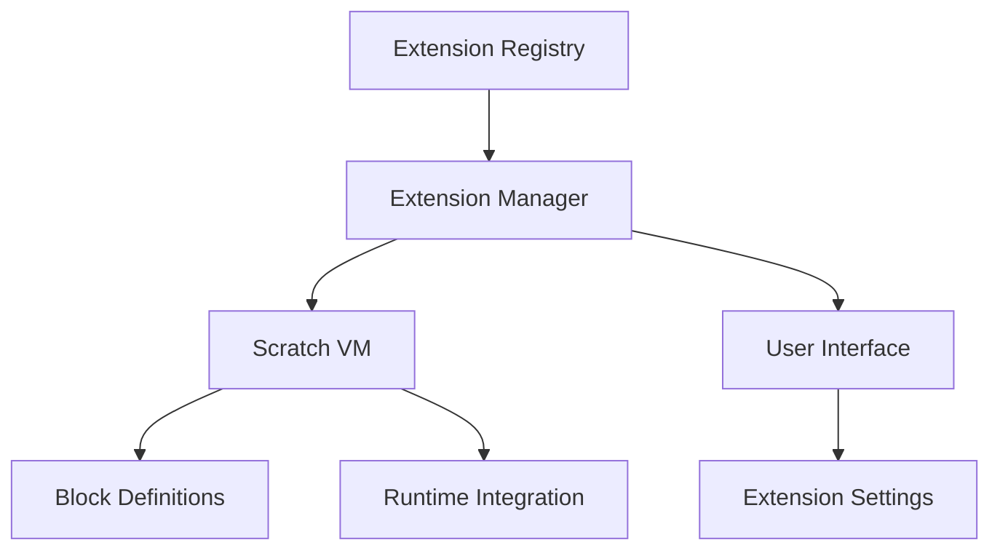

# 🔌 Extensions Guide

Comprehensive guide to creating and using extensions in OmniBlocks.

## 🎯 Overview

Extensions allow you to add new blocks, integrate with hardware/software, and extend OmniBlocks' functionality beyond the core feature set.

## 🏗️ Extension Architecture

### System Components



### Directory Structure

```
src/lib/libraries/extensions/
├── index.js             # Extension registry
├── extension-manager.js # Lifecycle management
├── extension-api.js     # API definitions
├── [extension-id]/      # Individual extensions
│   ├── extension.js     # Main extension file
│   ├── blocks.js        # Block definitions
│   ├── assets/          # Extension assets
│   └── package.json     # Extension metadata
├── custom/              # Custom extensions
└── tw/                  # TurboWarp extensions
```

## 🚀 Getting Started with Extensions

### Enabling Extensions

1. **Click Extensions Button**: Bottom-left corner
2. **Browse Extensions**: View available extensions
3. **Select Extension**: Click to enable
4. **New Blocks Appear**: In the blocks palette
5. **Configure**: Adjust extension settings if available

### Popular Extensions

| Category | Extensions | Status |
|----------|------------|--------|
| **Hardware** | micro:bit, LEGO, Arduino | ✅ Stable |
| **Software** | Text-to-Speech, Translate | ✅ Stable |
| **Games** | Game Controller, Video Sensing | ✅ Stable |
| **Music** | Music, MIDI | ✅ Stable |
| **Pen** | Pen Extensions | ✅ Stable |
| **Custom** | User-created extensions | 🟡 Varies |

## 🛠️ Developing Extensions

### Extension Anatomy

```javascript
// Basic extension structure
class MyExtension {
    getInfo() {
        return {
            id: 'myExtension',           // Unique identifier
            name: 'My Extension',        // Display name
            iconURI: 'data:image/...',   // Optional icon
            blocks: [                    // Array of blocks
                // Block definitions here
            ],
            menus: {                      // Optional menus
                // Menu definitions here
            },
            translation_map: {            // Optional translations
                // Translation mappings here
            }
        };
    }
    
    // Block implementations
    myBlockFunction(args) {
        // Block logic here
    }
}

// Register the extension
Scratch.extensions.register(new MyExtension());
```

### Creating Your First Extension

1. **Create Extension File**: `src/lib/libraries/extensions/my-extension/extension.js`
2. **Define Extension Class**: Implement `getInfo()` method
3. **Add Blocks**: Define block specifications
4. **Implement Functions**: Add block functionality
5. **Register Extension**: Call `Scratch.extensions.register()`
6. **Test**: Verify extension works in development mode

## 🔌 Extension API Reference

### Core Extension Methods

```javascript
// Register an extension
Scratch.extensions.register(extensionInstance);

// Unregister an extension
Scratch.extensions.unregister(extensionId);

// Get all registered extensions
const extensions = Scratch.extensions.getAll();

// Check if extension is loaded
const isLoaded = Scratch.extensions.isLoaded('extensionId');

// Get extension by ID
const extension = Scratch.extensions.get('extensionId');
```

### Block Types

```javascript
// Command Block (no return value)
{
    opcode: 'myCommand',
    blockType: Scratch.BlockType.COMMAND,
    text: 'do something [VALUE]',
    arguments: {
        VALUE: {
            type: Scratch.ArgumentType.STRING,
            defaultValue: 'hello'
        }
    },
    func: 'myCommandFunction'
}

// Reporter Block (returns value)
{
    opcode: 'myReporter',
    blockType: Scratch.BlockType.REPORTER,
    text: 'get value',
    func: 'getMyValue'
}

// Boolean Block (returns true/false)
{
    opcode: 'myBoolean',
    blockType: Scratch.BlockType.BOOLEAN,
    text: 'is condition true?',
    func: 'checkCondition'
}

// Hat Block (stack starter)
{
    opcode: 'myHat',
    blockType: Scratch.BlockType.HAT,
    text: 'when [EVENT] happens',
    arguments: {
        EVENT: {
            type: Scratch.ArgumentType.STRING,
            menu: 'events'
        }
    },
    func: 'handleEvent'
}

// Conditional Block (C-shaped)
{
    opcode: 'myConditional',
    blockType: Scratch.BlockType.CONDITIONAL,
    text: 'if [CONDITION] then',
    arguments: {
        CONDITION: {
            type: Scratch.ArgumentType.BOOLEAN
        }
    },
    branchCount: 1,
    func: 'evaluateCondition'
}
```

### Argument Types

```javascript
// String Argument
{
    type: Scratch.ArgumentType.STRING,
    defaultValue: 'default text',
    menu: 'stringOptions'  // Optional menu
}

// Number Argument
{
    type: Scratch.ArgumentType.NUMBER,
    defaultValue: 0,
    menu: 'numberOptions'  // Optional menu
}

// Boolean Argument
{
    type: Scratch.ArgumentType.BOOLEAN,
    defaultValue: false
}

// Color Argument
{
    type: Scratch.ArgumentType.COLOR,
    defaultValue: '#ff0000'
}

// Image Argument
{
    type: Scratch.ArgumentType.IMAGE,
    defaultValue: ''
}

// Custom Argument
{
    type: Scratch.ArgumentType.ANGLE,
    defaultValue: 90
}
```

### Menu Definitions

```javascript
// Static Menu
menus: {
    myMenu: {
        acceptReporters: true,
        items: [
            { text: 'Option 1', value: 'option1' },
            { text: 'Option 2', value: 'option2' }
        ]
    }
}

// Dynamic Menu
dynamicMenus: {
    myDynamicMenu: 'getMenuItems'
}

// Menu Function
getMenuItems: function() {
    return [
        { text: 'Dynamic Item 1', value: 'item1' },
        { text: 'Dynamic Item 2', value: 'item2' }
    ];
}
```

## 🧩 Block Implementation

### Basic Block Functions

```javascript
// Command Block Implementation
myCommandFunction(args) {
    console.log('Command executed with:', args.VALUE);
    // Perform action here
}

// Reporter Block Implementation
getMyValue(args) {
    return 'Hello from my extension!';
}

// Boolean Block Implementation
checkCondition(args) {
    return true; // or false
}

// Hat Block Implementation
handleEvent(args) {
    console.log('Event occurred:', args.EVENT);
    // Start script execution
}
```

### Advanced Block Features

```javascript
// Block with Multiple Arguments
{
    opcode: 'complexBlock',
    blockType: Scratch.BlockType.COMMAND,
    text: 'do [ACTION] with [VALUE1] and [VALUE2]',
    arguments: {
        ACTION: {
            type: Scratch.ArgumentType.STRING,
            menu: 'actions'
        },
        VALUE1: {
            type: Scratch.ArgumentType.NUMBER,
            defaultValue: 0
        },
        VALUE2: {
            type: Scratch.ArgumentType.STRING,
            defaultValue: 'default'
        }
    },
    func: 'complexFunction'
}

// Block with Branch
{
    opcode: 'conditionalBlock',
    blockType: Scratch.BlockType.CONDITIONAL,
    text: 'if [CONDITION] then [SUBSTACK] else [SUBSTACK2]',
    arguments: {
        CONDITION: {
            type: Scratch.ArgumentType.BOOLEAN
        }
    },
    branchCount: 2,
    func: 'evaluateCondition'
}

// Block with Loop
{
    opcode: 'repeatBlock',
    blockType: Scratch.BlockType.LOOP,
    text: 'repeat [TIMES] times [SUBSTACK]',
    arguments: {
        TIMES: {
            type: Scratch.ArgumentType.NUMBER,
            defaultValue: 10
        }
    },
    branchCount: 1,
    func: 'repeatAction'
}
```

## 🎯 Target Types and Filters

### Target Types

```javascript
// Extension with Target Types
export default class MyExtension {
    getInfo() {
        return {
            id: 'myExtension',
            name: 'My Extension',
            targetTypes: ['myHardware', 'sprite'],
            blocks: [
                {
                    opcode: 'hardwareBlock',
                    blockType: Scratch.BlockType.COMMAND,
                    text: 'send command to hardware',
                    filter: ['myExtension.myHardware']
                },
                {
                    opcode: 'spriteBlock',
                    blockType: Scratch.BlockType.COMMAND,
                    text: 'sprite-specific command',
                    filter: ['sprite']
                }
            ]
        };
    }
}
```

### Filter Examples

```javascript
// Filter by target type
filter: ['sprite']                  // Only sprites
filter: ['stage']                   // Only stage
filter: ['myExtension.myHardware']  // Only specific hardware

// Multiple target types
filter: ['sprite', 'stage']        // Sprites and stage
filter: ['myExtension.*']          // All this extension's targets

// Complex filters
filter: function(target) {
    return target.isSprite && target.visible;
}
```

## 🌐 Hardware Extensions

### Hardware Integration

```javascript
// micro:bit Extension Example
export default class MicrobitExtension {
    getInfo() {
        return {
            id: 'microbit',
            name: 'micro:bit',
            targetTypes: ['microbit'],
            blocks: [
                {
                    opcode: 'showLed',
                    blockType: Scratch.BlockType.COMMAND,
                    text: 'show LED [X] [Y]',
                    arguments: {
                        X: { type: Scratch.ArgumentType.NUMBER },
                        Y: { type: Scratch.ArgumentType.NUMBER }
                    },
                    filter: ['microbit']
                },
                {
                    opcode: 'getButtonPressed',
                    blockType: Scratch.BlockType.BOOLEAN,
                    text: 'button [BUTTON] pressed?',
                    arguments: {
                        BUTTON: {
                            type: Scratch.ArgumentType.STRING,
                            menu: 'buttons'
                        }
                    },
                    filter: ['microbit']
                }
            ],
            menus: {
                buttons: {
                    items: [
                        { text: 'A', value: 'a' },
                        { text: 'B', value: 'b' }
                    ]
                }
            }
        };
    }
    
    // Hardware communication
    showLed(args) {
        const device = this._getDevice();
        if (device) {
            device.showLed(args.X, args.Y);
        }
    }
    
    getButtonPressed(args) {
        const device = this._getDevice();
        return device ? device.isButtonPressed(args.BUTTON) : false;
    }
    
    _getDevice() {
        // Hardware connection logic
    }
}
```

### Hardware Connection

```javascript
// Connection Management
class HardwareExtension {
    constructor(runtime) {
        this.runtime = runtime;
        this.device = null;
        this.connected = false;
    }
    
    onConnect() {
        // Initialize hardware connection
        this.device = new HardwareDevice();
        this.connected = true;
        
        // Set up event listeners
        this.device.on('disconnect', () => {
            this.connected = false;
            this.runtime.emit('HARDWARE_DISCONNECTED');
        });
    }
    
    onDisconnect() {
        if (this.device) {
            this.device.close();
            this.device = null;
            this.connected = false;
        }
    }
    
    isConnected() {
        return this.connected;
    }
}
```

## 📱 Software Extensions

### API Integration

```javascript
// Text-to-Speech Extension
export default class TextToSpeechExtension {
    getInfo() {
        return {
            id: 'textToSpeech',
            name: 'Text to Speech',
            blocks: [
                {
                    opcode: 'speak',
                    blockType: Scratch.BlockType.COMMAND,
                    text: 'speak [TEXT]',
                    arguments: {
                        TEXT: {
                            type: Scratch.ArgumentType.STRING,
                            defaultValue: 'Hello'
                        }
                    }
                },
                {
                    opcode: 'setVoice',
                    blockType: Scratch.BlockType.COMMAND,
                    text: 'set voice to [VOICE]',
                    arguments: {
                        VOICE: {
                            type: Scratch.ArgumentType.STRING,
                            menu: 'voices'
                        }
                    }
                }
            ],
            menus: {
                voices: {
                    acceptReporters: true,
                    items: ['male', 'female', 'child'].map(voice => ({
                        text: voice.charAt(0).toUpperCase() + voice.slice(1),
                        value: voice
                    }))
                }
            }
        };
    }
    
    speak(args) {
        const utterance = new SpeechSynthesisUtterance(args.TEXT);
        speechSynthesis.speak(utterance);
    }
    
    setVoice(args) {
        // Voice selection logic
    }
}
```

### Web Service Integration

```javascript
// Translation Extension
export default class TranslationExtension {
    constructor(runtime) {
        this.runtime = runtime;
        this.apiKey = 'your-api-key';
        this.cache = {};
    }
    
    getInfo() {
        return {
            id: 'translation',
            name: 'Translation',
            blocks: [
                {
                    opcode: 'translate',
                    blockType: Scratch.BlockType.REPORTER,
                    text: 'translate [TEXT] to [LANGUAGE]',
                    arguments: {
                        TEXT: {
                            type: Scratch.ArgumentType.STRING,
                            defaultValue: 'Hello'
                        },
                        LANGUAGE: {
                            type: Scratch.ArgumentType.STRING,
                            menu: 'languages'
                        }
                    }
                }
            ],
            menus: {
                languages: {
                    items: [
                        { text: 'Spanish', value: 'es' },
                        { text: 'French', value: 'fr' },
                        { text: 'German', value: 'de' }
                    ]
                }
            }
        };
    }
    
    async translate(args) {
        const cacheKey = `${args.TEXT}:${args.LANGUAGE}`;
        
        // Check cache
        if (this.cache[cacheKey]) {
            return this.cache[cacheKey];
        }
        
        // Call translation API
        try {
            const response = await fetch(
                `https://api.translate.com/translate?text=${encodeURIComponent(args.TEXT)}&to=${args.LANGUAGE}&key=${this.apiKey}`
            );
            const data = await response.json();
            
            // Cache result
            this.cache[cacheKey] = data.translatedText;
            
            return data.translatedText;
        } catch (error) {
            console.error('Translation failed:', error);
            return args.TEXT; // Fallback to original
        }
    }
}
```

## 🎨 Custom Extensions

### Creating Custom Extensions

1. **Fork scratch-vm**: Extensions run in scratch-vm
2. **Create Extension File**: Add to `src/extensions/`
3. **Define Blocks**: Implement your block definitions
4. **Register Extension**: Add to extension registry
5. **Link to OmniBlocks**: Update scratch-vm dependency
6. **Test**: Verify extension works

### Custom Extension Example

```javascript
// src/extensions/my-custom-extension/index.js
export default class MyCustomExtension {
    getInfo() {
        return {
            id: 'myCustomExtension',
            name: 'My Custom Extension',
            color1: '#4C97FF',
            color2: '#3A82E7',
            blocks: [
                {
                    opcode: 'customCommand',
                    blockType: Scratch.BlockType.COMMAND,
                    text: 'do custom action with [INPUT]',
                    arguments: {
                        INPUT: {
                            type: Scratch.ArgumentType.STRING,
                            defaultValue: 'default'
                        }
                    }
                },
                {
                    opcode: 'customReporter',
                    blockType: Scratch.BlockType.REPORTER,
                    text: 'get custom value'
                }
            ]
        };
    }
    
    customCommand(args) {
        console.log('Custom command executed:', args.INPUT);
        // Your custom logic here
    }
    
    customReporter() {
        return 'Custom value from extension';
    }
}
```

## 🌍 Internationalization

### Translation Support

```javascript
// Extension with Translations
export default class MyExtension {
    getInfo() {
        return {
            id: 'myExtension',
            name: 'My Extension',
            translation_map: {
                'es': {  // Spanish
                    'myExtension': 'Mi Extensión',
                    'customCommand': 'hacer acción personalizada con [INPUT]',
                    'customReporter': 'obtener valor personalizado'
                },
                'fr': {  // French
                    'myExtension': 'Mon Extension',
                    'customCommand': 'faire action personnalisée avec [INPUT]',
                    'customReporter': 'obtenir valeur personnalisée'
                }
            }
        };
    }
}
```

### Dynamic Translation

```javascript
// Dynamic translation handling
getTranslatedText(key, language) {
    const translations = this.getInfo().translation_map;
    
    if (translations && translations[language] && translations[language][key]) {
        return translations[language][key];
    }
    
    // Fallback to English or default
    return key;
}
```

## 🧪 Testing Extensions

### Testing Framework

```javascript
// Extension test example
describe('My Extension', () => {
    let extension;
    let runtime;
    
    beforeAll(() => {
        runtime = new Scratch.Runtime();
        extension = new MyExtension(runtime);
    });
    
    test('should have correct info', () => {
        const info = extension.getInfo();
        expect(info.id).toBe('myExtension');
        expect(info.name).toBe('My Extension');
        expect(info.blocks.length).toBeGreaterThan(0);
    });
    
    test('should execute custom command', () => {
        const mockCallback = jest.fn();
        extension.customCommand = mockCallback;
        
        extension.customCommand({ INPUT: 'test' });
        
        expect(mockCallback).toHaveBeenCalledWith({ INPUT: 'test' });
    });
    
    test('should return custom value', () => {
        const result = extension.customReporter();
        expect(result).toBe('Custom value from extension');
    });
});
```

### Test Coverage

- **Block Functionality**: Test all block implementations
- **Argument Handling**: Verify argument processing
- **Error Conditions**: Test edge cases and invalid inputs
- **Performance**: Measure execution time
- **Memory Usage**: Check for memory leaks
- **Compatibility**: Test across different browsers

## 📦 Packaging Extensions

### Extension Package Structure

```
my-extension/
├── extension.js         # Main extension file
├── blocks.js            # Block definitions (optional)
├── assets/              # Extension assets
│   ├── icons/           # Icon files
│   └── images/          # Image assets
├── package.json         # Extension metadata
├── README.md            # Documentation
└── LICENSE              # License information
```

### Package Metadata

```json
{
    "name": "my-extension",
    "version": "1.0.0",
    "description": "Description of my extension",
    "author": "Your Name <your@email.com>",
    "license": "MIT",
    "scratch": {
        "extensionId": "myExtension",
        "extensionName": "My Extension",
        "extensionColor": "#4C97FF",
        "extensionSecondaryColor": "#3A82E7",
        "blocks": [
            {
                "opcode": "customCommand",
                "blockType": "command",
                "text": "do custom action with [INPUT]"
            }
        ]
    },
    "keywords": ["scratch", "extension", "omniblocks"]
}
```

## 🚧 Troubleshooting Extensions

### Common Issues

| Issue | Cause | Solution |
|-------|-------|----------|
| **Extension not loading** | Registration error | Check extension registration |
| **Blocks not appearing** | Invalid block definition | Validate block specifications |
| **Runtime errors** | Implementation bugs | Debug block functions |
| **Performance issues** | Heavy computations | Optimize extension code |
| **Memory leaks** | Uncleaned resources | Proper resource management |
| **Compatibility issues** | Version mismatch | Check scratch-vm compatibility |

### Debugging Techniques

```javascript
// Debug extension loading
console.log('Extension loading:', this.getInfo());

// Check block registration
console.log('Registered blocks:', this.getInfo().blocks);

// Monitor block execution
originalFunction = this.myBlockFunction;
this.myBlockFunction = function(args) {
    console.log('Block executed with:', args);
    return originalFunction.call(this, args);
};

// Profile performance
console.time('extension-operation');
// ... extension code
console.timeEnd('extension-operation');
```

## 📚 Best Practices

### Development Best Practices

1. **Modular Design**: Keep extensions focused and independent
2. **Error Handling**: Gracefully handle errors and edge cases
3. **Performance**: Optimize for minimal impact on project execution
4. **Documentation**: Provide clear usage instructions and examples
5. **Testing**: Comprehensive test coverage for all blocks
6. **Versioning**: Follow semantic versioning
7. **Compatibility**: Test across scratch-vm versions
8. **Security**: Validate all inputs and outputs

### User Experience Best Practices

1. **Clear Block Names**: Use descriptive and intuitive names
2. **Helpful Tooltips**: Provide context for complex blocks
3. **Consistent Behavior**: Follow Scratch block conventions
4. **Error Messages**: Guide users when issues occur
5. **Performance Indicators**: Show progress for long operations
6. **Undo Support**: Allow users to revert extension actions
7. **Localization**: Support multiple languages
8. **Documentation**: Provide in-extension help

## 🌍 Extension Ecosystem

### Official Extensions

- **Maintained by OmniBlocks/TurboWarp teams**
- **High quality and well-tested**
- **Full documentation and support**
- **Regular updates and security patches**

### Community Extensions

- **Created by community members**
- **Varied quality and support levels**
- **Experimental features and innovations**
- **Diverse functionality and use cases**

### Third-Party Extensions

- **Commercial extensions**
- **Organization-specific extensions**
- **Hardware manufacturer extensions**
- **Educational institution extensions**

## 🤝 Contributing Extensions

### Submission Process

1. **Develop**: Create your extension in scratch-vm
2. **Test**: Verify functionality and compatibility
3. **Document**: Write clear documentation and examples
4. **Package**: Prepare extension package
5. **Submit**: Open pull request to scratch-vm
6. **Review**: Address feedback and make improvements
7. **Merge**: Extension becomes available

### Contribution Guidelines

- **Code Quality**: Follow scratch-vm coding standards
- **Documentation**: Provide comprehensive documentation
- **Testing**: Include test cases and scenarios
- **Compatibility**: Support current and recent scratch-vm versions
- **Security**: Follow security best practices
- **Performance**: Optimize for minimal impact
- **Accessibility**: Ensure extension is accessible
- **Localization**: Support internationalization

## 🚀 Future of Extensions

### Planned Enhancements

1. **Extension Marketplace**: Centralized discovery and installation
2. **Automatic Updates**: Keep extensions up-to-date
3. **Dependency Management**: Handle extension dependencies
4. **Sandboxing**: Improved security and isolation
5. **Performance Monitoring**: Track extension impact
6. **User Ratings**: Community feedback system
7. **Extension Analytics**: Usage statistics (opt-in)
8. **Extension Bundles**: Group related extensions

### Community Opportunities

- **New Extension Categories**: Expand functionality areas
- **Extension Templates**: Starter kits for common patterns
- **Extension Documentation**: Improved guides and tutorials
- **Extension Testing**: Enhanced test frameworks
- **Extension Tooling**: Development tools and utilities
- **Extension Examples**: Showcase innovative extensions

## 📖 Additional Resources

- **Scratch Extension Documentation**: [https://github.com/LLK/scratch-vm/blob/develop/docs/extensions.md](https://github.com/LLK/scratch-vm/blob/develop/docs/extensions.md)
- **TurboWarp Extension Guide**: [https://docs.turbowarp.org/development/extensions](https://docs.turbowarp.org/development/extensions)
- **Scratch VM Source**: [https://github.com/LLK/scratch-vm](https://github.com/LLK/scratch-vm)
- **OmniBlocks Extension Examples**: [https://github.com/OmniBlocks/scratch-gui/tree/main/src/examples](https://github.com/OmniBlocks/scratch-gui/tree/main/src/examples)

For more information about extending OmniBlocks, see our [Addons System Documentation](Addons-System.md) and [Development Setup Guide](Development-Setup.md).